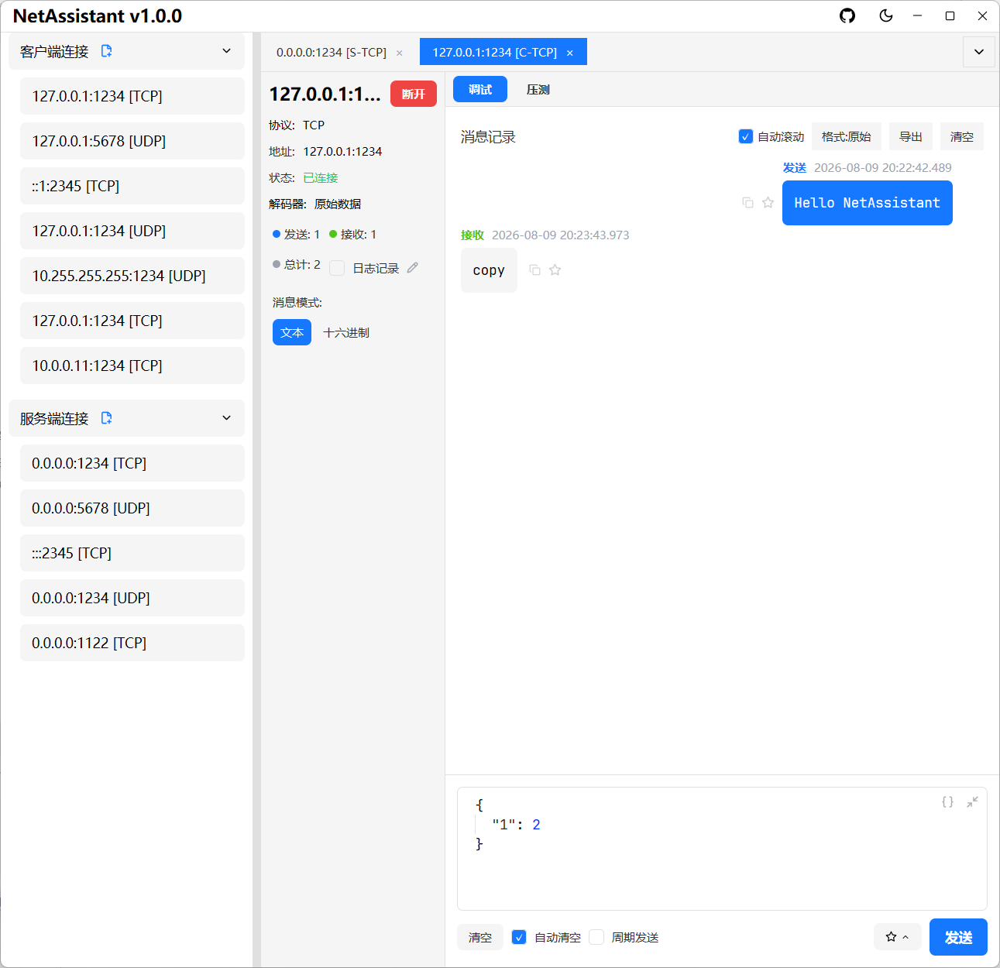
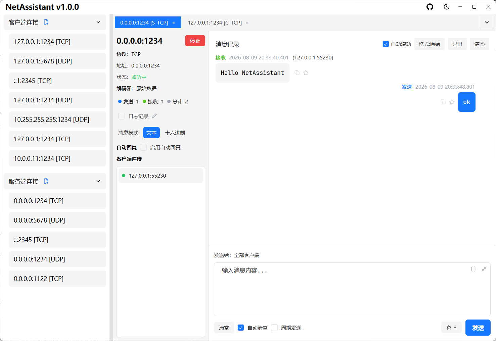
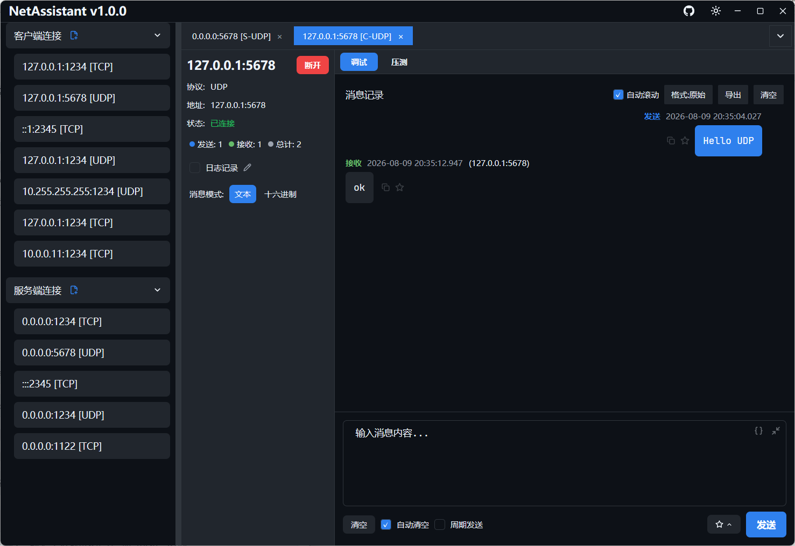
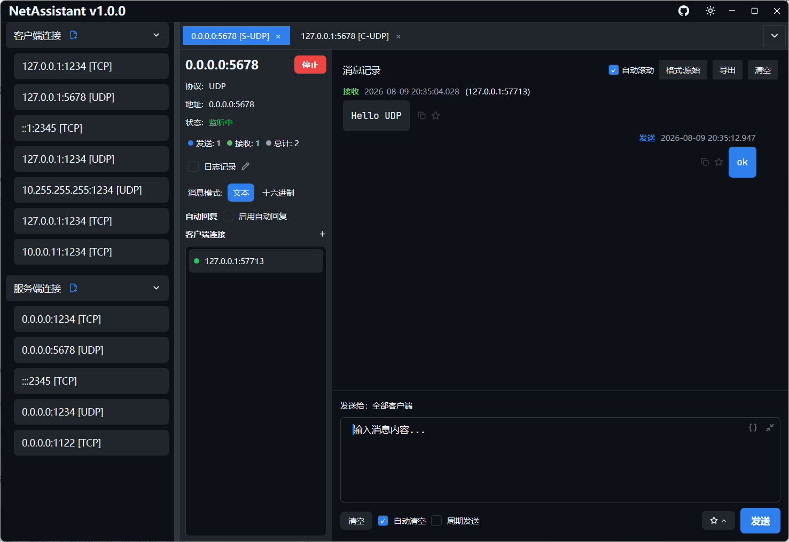
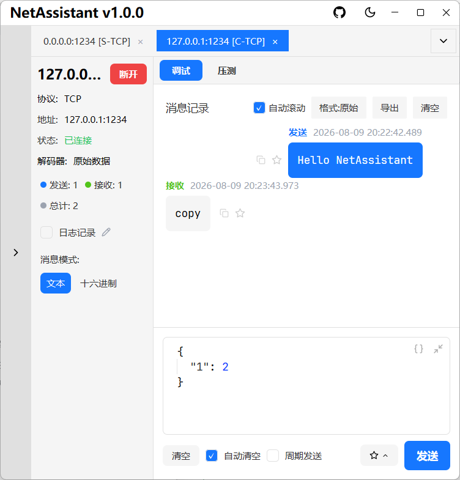

# NetAssistant

<div align="center">

**A high-performance, modern network debugging tool built with Rust**

[](https://www.rust-lang.org)
[](https://opensource.org/licenses/MIT)

English | [中文](README.md)

</div>

---

## Introduction

NetAssistant is a high-performance, modern **cross-platform** network debugging tool built with Rust, **supporting Windows, Linux, and macOS systems**. It provides an intuitive interface for testing and debugging network communications, supporting TCP/UDP client and server modes, helping developers quickly verify network communication logic and data formats. It is a powerful assistant for network application development, hardware debugging, and embedded system development.

## ✨ Features

### Core Features
- **Multi-protocol support**: Complete TCP/UDP client and server modes
- **IPv4/IPv6 dual stack**: Supports both IPv4 and IPv6 protocols, adapting to various network environments
- **Multiple TCP decoders**: Supports raw data, line-based decoding, length-prefixed decoding, and JSON decoding to meet different protocol format requirements, effectively solving TCP sticky packet issues
- **JSON formatting**: Send box provides "Beautify"/"Minify" buttons in text mode to format outgoing content; receiver top toolbar toggles global display format (Raw/Beautify/Minify), supports pretty indentation and compact display; non-JSON content is returned as-is
- **Chat-style message logging**: Intuitive display of message interactions, facilitating debugging and analysis
- **Configuration persistence**: Automatically saves connection configurations for direct use next time
- **Connection editing**: Saved connection configurations can be directly edited and modified without deleting and recreating

### Message Management Features
- **Copy message**: Quickly copy a single message to the clipboard, supporting both text and hexadecimal formats
- **Favorite message**: Add important messages to the favorites, support adding remarks to favorite items, and provide keyword search
- **Real-time log recording**: After manual enabling, all sent/received messages are asynchronously written to log file in real-time (flushed per message), supports custom save path, auto-flush and close on disconnection; log filename is clickable to open directory
- **On-demand manual export**: Don't need continuous logging? You can export current message records anytime as TXT/JSON/CSV files for archiving, sharing, and secondary analysis
- **UDP broadcast reply smart display**: Optimized for IoT/embedded device discovery scenarios. When sending commands to broadcast addresses, all device replies are received; replies from unexpected addresses are highlighted in red, ensuring no important responses are lost

### Automated Testing Features
- **Auto-reply functionality**: Supports test auto-replies, simulating server or client responses
- **Periodic send functionality**: Supports timed periodic message sending for stress testing or long-term stability testing
- **Stress testing**: Built-in TCP/UDP high-concurrency stress testing engine, real-time display of QPS (current/peak), total sent/success/failure, active connections (current/peak), disconnects/reconnects, bytes sent/received statistics; p50/p95/p99/avg/max latency percentiles **only shown in Ping-Pong (round-trip) mode** (this mode waits for response to measure RTT latency); supports failure breakdown (connect failed/send failed/recv timeout/peer closed/validate failed) to help quickly identify bottlenecks, supports variable templates (`${seq}` global sequence, `${worker_id}` thread ID, `${counter}` local counter, `${timestamp}` timestamp, `${uuid}` random UUID, `${random:min:max}` random integer), auto-save configs for reuse, and CSV report export

### Modern Interface
- **Dark mode support**: Automatically adapts to system themes, providing a comfortable night-time experience
- **Multi-tab management**: Manage multiple connections simultaneously for easy switching and comparison
- **Client message viewing**: Select specific clients to view their messages in server mode
- **UDP manual add client**: In UDP server mode, you can manually add client addresses to actively send data to specified addresses (due to UDP's connectionless nature)

## 🎯 Use Cases

- **Developer Communication Verification**: Including backend developers simulating hardware data before hardware integration, and network application developers testing communication logic and data formats between clients and servers, verifying the correctness and robustness of servers or applications
- **Hardware Device Testing**: Covering hardware engineers testing conventional hardware devices (such as sensors, controllers, etc.), and embedded developers verifying network protocol stack implementation, data transmission efficiency, and memory usage of resource-constrained embedded systems, ensuring normal operation of device network functions
- **Service Performance Stress Testing**: Utilize the built-in stress testing feature to evaluate concurrent throughput, latency distribution, and stability of self-developed servers, quickly locating performance bottlenecks

## 📸 Interface Preview

### Client Mode


### Server Mode


### IPv6 Support


### TCP Decoder


### Hex Mode


### Favorite Message


### UDP Manual Add Client


### Stress Testing Configuration (Dark Mode)


### Stress Testing Result


### UDP Client Dark Mode


### UDP Server Dark Mode


### Collapsed Mode


## 🚀 Quick Start

### System Requirements

- **Windows**: 10 or later
- **Linux**: Requires GTK3 library (e.g., Ubuntu 22.04 and above)
- **macOS**: 10.15 or later

### Installation

#### Windows
**Recommended Method: Install via winget**
- Advantages: Supports automatic upgrades, easier installation and management
- Steps:
  1. First install winget (built-in on Windows 10 1809+ or Windows 11, or refer to [Microsoft official documentation](https://learn.microsoft.com/en-us/windows/package-manager/winget/) for installation methods)
  2. Open Command Prompt or PowerShell and run:
     ```bash
     winget install SunJary.NetAssistant
     ```
  3. To upgrade later, simply run:
     ```bash
     winget upgrade SunJary.NetAssistant
     ```

**Alternative Method: Download from GitHub Release**
Please visit the [GitHub Release page](https://github.com/sunjary/netassistant/releases) to download the latest version.

#### Linux
**Recommended Method: Download from GitHub Release**
- Steps:
  1. Please visit the [GitHub Release page](https://github.com/sunjary/netassistant/releases) to download the latest Linux compressed package
  2. Extract the installation package:
     ```bash
     tar -xzf netassistant-linux-x64.tar.gz
     ```
  3. Run the executable file:
     ```bash
     ./netassistant
     ```

#### macOS
**Recommended Method: Download from GitHub Release**
- Steps:
  1. Please visit the [GitHub Release page](https://github.com/sunjary/netassistant/releases) to download the latest macOS compressed package
  2. Extract the installation package
  3. Drag NetAssistant to the Applications folder
  4. Right-click the application and select "Open" to run (required for first run)

### Running

Run the corresponding executable file according to the installation method for different operating systems.

## 💡 Usage

1. **Create Connection**
   - Click the `[+New]` button in the left panel
   - Select connection type (Client/Server)
   - Select protocol (TCP/UDP)
   - Fill in address and port
   - After creation, you can configure TCP decoder type in the connection details page

2. **Connect to Server**
   - For client connections, click the `[Connect]` button
   - For server connections, click the `[Start]` button

3. **Select Message Mode**
   - Above the bottom input box, select the message sending mode: Text mode or Hex mode
   - Text mode: Directly enter string messages
   - Hex mode: Enter hexadecimal format data, such as "0A0B0C"

4. **Send Messages**
   - Enter message content in the bottom input box
   - Click the `[Send]` button or press Enter to send

5. **Periodic Send**
   - Enable periodic send functionality in the connection tab
   - Set send interval (milliseconds)
   - Click the `[Send]` button to start periodic sending
   - Uncheck periodic send to stop the sending task

6. **Auto-reply**
   - Enable auto-reply functionality in the connection tab
   - Set auto-reply content
   - Auto-reply when receiving messages

7. **Message Management**
   - **Copy message**: Click the copy button on a message item to copy its content to the clipboard
   - **Favorite message**: Click the favorite button on a message item to add it to favorites; you can add remarks to favorite items in the popup and quickly locate them via keyword search
   - **JSON formatting**:
     - Sender: In text input mode, "Beautify" and "Minify" buttons are available next to the input box to format outgoing JSON content
     - Receiver: Top toolbar has "Format: Raw/Beautify/Minify" button to switch display format for all messages; non-JSON content is displayed as-is
   - **Export message records**: Click the export button in the connection tab, select TXT / JSON / CSV format and save to a local file
   - **Real-time log recording**: Click the "Log" toggle to manually enable/disable recording; when enabled, all messages are asynchronously written to log file in real-time (flushed per message); default save path is `Documents/NetAssistant/logs/`, click the pencil button next to it to customize save path; log filename is clickable to open the directory; logs are automatically flushed and closed on disconnection

8. **Edit Connection Configuration**
   - For saved connection configurations, right-click the connection and select Edit, or click the edit button
   - Protocol type, address, port and other configurations can be modified without deleting and recreating

9. **UDP Manual Add Client**
   - In UDP server mode, click the `[+Add Client]` button
   - Enter the target client's IP and port
   - After adding, you can actively send messages to that address

10. **UDP Device Discovery Scenario (IoT/Embedded Debugging)**
    - When discovering IoT/embedded devices on the LAN, send discovery commands to a broadcast address (e.g., `192.168.1.255`)
    - All device replies are displayed normally (not filtered by source address)
    - Replies from unexpected addresses have their source addresses **highlighted in light red**, with a tooltip showing "Reply from unexpected address" on hover, helping you identify which devices responded
    - This ensures no important device responses are lost while clearly distinguishing broadcast replies from normal replies to the target address

11. **Stress Testing**
    - Switch to the stress test page via the "Stress" entry on the connection tab
    - Fill in target address, port, concurrent client count, send rate, message content, and variable templates (supports `${seq}`, `${worker_id}`, `${counter}`, `${timestamp}`, `${uuid}`, `${random:min:max}`)
    - Stress modes:
      - **Ping-Pong (Round-trip) mode**: Waits for response after sending, measures RTT latency (p50/p95/p99/avg/max), suitable for API performance testing
      - **Throughput mode**: Sends without waiting for response, no latency measurement, suitable for maximum throughput testing
    - Connection modes: Short connection (new connection per request), Long connection
    - After clicking start, view QPS (current/peak), total sent/success/failure, active connections (current/peak), disconnects/reconnects, bytes sent/received in real time on the stress test panel; failure breakdown (connect failed/send failed/recv timeout/peer closed/validate failed) is automatically shown when there are failures
    - Stress test configurations are automatically saved and restored next time you open
    - After the test, you can export a CSV report; click the stop button to terminate the test at any time

12. **Manage Connections**
    - Use tabs to switch between different connections
    - Click the `×` on the tab to close the connection
    - Right-click on the connection to delete or edit saved configuration

13. **Client Message Viewing**
    - In server mode, the left panel displays the list of connected clients
    - Click a single client address to select it, and the right message list will only show messages from that client
    - Click the selected client again to deselect and restore all messages
    - Server replies to the client will also be included in the viewing results

## 🎯 Technical Highlights

### ⚡ Extreme Performance

- **Rust-powered**: Built with Rust for maximum performance and security
  - Zero-cost abstractions, compile-time optimizations
  - Memory safety guarantees, no garbage collection
  - Modern concurrency model

- **Tokio async runtime**: Efficient async I/O operations
  - High-performance event loop based on epoll/kqueue
  - Non-blocking I/O, maximizes system resource utilization
  - Lightweight task scheduling, supports millions of concurrent connections

### 🎨 Modern Interface

- **GPUI framework**: Cutting-edge GPU-accelerated UI
  - GPU-based rendering, fully utilizing hardware acceleration
  - Hardware-accelerated text rendering
  - Smooth 60fps experience

- **Adaptive theme**: Automatically adapts to system themes, supporting light and dark modes
  - Provides a comfortable visual experience
  - Reduces visual fatigue during prolonged use

- **Responsive design**: Adaptive layout for different screen sizes
  - Flexible window size adjustment
  - Adaptive message display
  - Optimized space utilization

### 🔧 Core Features

- **Real-time message monitoring**: Instant message display and auto-scroll
  - Millisecond-level message response
  - Auto-scroll to latest messages
  - Message timestamps accurate to milliseconds

- **Smart decoder**: Multiple decoding methods, adapting to different protocol formats
  - Supports raw data, line-delimited, length-prefixed, and JSON formats
  - Flexible switching based on protocol requirements

- **Stress test engine**: Independent stress testing engine layer
  - Pure logic design with zero GPUI dependencies, easy to reuse and test
  - Token bucket-based rate limiting, precisely controls send frequency
  - Built-in watchdog mechanism, ensures automatic cleanup after abnormal disconnections

- **Connection management**: Supports multiple simultaneous connections
  - Multi-tab interface
  - Independent connection state management
  - Convenient connection switching

## 🛠️ Technology Stack

### Core Frameworks
- [GPUI](https://github.com/zed-industries/zed) - GPU-accelerated UI framework
  - High-performance GPU rendering
  - Modern component model
  - Responsive state management

- [gpui-component](https://github.com/longbridge/gpui-component) - Modern UI component library
  - Rich UI components
  - Unified design language
  - Easy to customize and extend

### Network and Async
- [Tokio](https://tokio.rs/) - Network async runtime
  - High-performance async I/O
  - Rich network protocol support
  - Mature production-ready solution

## 📊 Performance Metrics

During development, we used the built-in stress testing feature to perform high-concurrency testing on NetAssistant itself, which helped discover and optimize multiple performance bottlenecks (batch message updates, batch log writing, etc.), ensuring smooth performance even under high load:

- **Startup time**: < 100ms
  - Quick startup, no waiting
  - Instant response to user operations

- **Message throughput**
  - High-concurrency message processing with batch update optimization to reduce CPU usage
  - Low-latency message transmission

- **Memory usage**: < 20MB
  - Lightweight resource usage
  - Optimized message storage for stable memory under high load

- **UI response**: 60fps rendering
  - Smooth user experience
  - Lag-free interactions even with high message volumes

## 🏗️ Project Structure

```
netassistant/
├── src/                       # Source code directory
│   ├── main.rs                # Application entry: initialize logging, create app instance, start main window
│   ├── app.rs                 # Main application logic: manage connections, handle network events, state management
│   ├── message.rs             # Message processing: define message structure, direction, favorite items, etc.
│   ├── export.rs              # Message export: supports TXT/JSON/CSV formats
│   ├── assets.rs              # Resource loading: icons, fonts, etc.
│   ├── custom_icons.rs        # Custom icon definitions
│   ├── log_writer.rs          # Log writer
│   ├── theme_detector.rs      # Theme detection
│   ├── theme_event_handler.rs # Theme event handling
│   ├── theme_manager.rs       # Theme management
│   ├── update_checker.rs      # Application update checker
│   ├── config/                # Configuration management: connection config, app stats, storage and loading
│   │   ├── connection.rs      # Connection config and type definitions
│   │   ├── storage.rs         # Configuration persistence storage
│   │   ├── app_stats.rs       # Application statistics data
│   │   └── mod.rs             # Configuration module export
│   ├── core/                  # Core logic: pure logic layer decoupled from UI
│   │   └── message_processor.rs # Message processor
│   ├── network/               # Network communication: TCP/UDP protocols, encoding/decoding, connection management
│   │   ├── connection/        # Connection management: client and server connections
│   │   │   └── manager.rs     # Connection manager
│   │   ├── protocol/          # Protocol implementation: TCP/UDP protocol handling and decoders
│   │   │   ├── tcp.rs         # TCP protocol
│   │   │   ├── udp.rs         # UDP protocol
│   │   │   └── decoder.rs     # Decoder (raw/line/length-prefixed/JSON)
│   │   ├── events.rs          # Network event definitions
│   │   └── interfaces.rs      # Network interface abstractions
│   ├── stress/                # Stress testing module: engine layer with zero GPUI dependencies
│   │   ├── engine.rs          # Stress engine: schedule workers, aggregate statistics
│   │   ├── client_worker.rs   # Client worker: long/short connection send logic
│   │   ├── config.rs          # Stress test configuration
│   │   ├── port_range.rs      # Port range parsing
│   │   ├── rate_limiter.rs    # Token bucket rate limiter
│   │   ├── stats.rs           # Real-time statistics (QPS/latency percentiles)
│   │   ├── report.rs          # CSV report generation
│   │   ├── variables.rs       # Variable templates (seq/worker_id/counter, etc.)
│   │   └── events.rs          # Stress event definitions
│   ├── ui/                    # UI components: build user interface and handle user interaction
│   │   ├── main_window.rs     # Main window component
│   │   ├── connection_panel.rs# Connection panel: display and manage connections
│   │   ├── connection_tab.rs  # Connection tab: each tab corresponds to one connection
│   │   ├── stress_panel.rs    # Stress test panel: real-time display of stress metrics
│   │   ├── tab_container.rs   # Tab container
│   │   ├── components/        # Common UI components
│   │   │   └── input_with_mode.rs # Input box with mode switching (text/hex)
│   │   └── dialog/            # Dialogs
│   │       ├── new_connection.rs   # New/Edit connection dialog
│   │       ├── add_client.rs       # UDP manual add client dialog
│   │       ├── decoder_selection.rs# Decoder selection dialog
│   │       ├── favorite_list.rs    # Favorite list dialog
│   │       ├── favorite_remark.rs  # Favorite remark dialog
│   │       ├── port_limit_help.rs  # Port limit help dialog
│   │       └── stress_config.rs    # Stress test configuration dialog
│   └── utils/                 # Utility functions: common tools and helper functions
│       ├── hex.rs             # Hexadecimal data processing
│       └── text_measurement.rs# Text measurement
├── assets/                    # Resource files: icons, fonts, and screenshots
│   ├── icon/                  # Application icon files
│   ├── icons/                 # SVG vector icons
│   ├── fonts/                 # Embedded fonts (JetBrains Mono)
│   └── screenshots/           # Application screenshots
├── themes/                    # Theme configuration files
├── .cargo/                    # Cargo configuration: Rust build tool configuration
├── .github/                   # GitHub configuration: CI/CD workflows
├── Cargo.toml                 # Project configuration: dependency management and project metadata
├── Cargo.lock                 # Dependency lock file: fix dependency versions
├── README.md                  # Project documentation: Chinese description
├── README-en.md               # English documentation: English description
└── build.rs                   # Build script: custom build logic
```

## 🔮 Future Plans

- [ ] File data source
- [ ] Multi-language support
- [ ] Hex editor
- [ ] Support SSE debugging
- [ ] Support more data format encoding and decoding
- [ ] Support WebSocket protocol

## ❓ FAQ

**Q: Which operating systems are supported?**  
A: Windows 10/11, Linux (requires GTK3), and macOS 10.15+.

**Q: How many connections can be managed simultaneously?**  
A: There's no theoretical limit, depends on system resources. Managing 10-20 connections simultaneously works perfectly in practice.

**Q: Why are some message addresses red in UDP mode?**  
A: Red addresses indicate the message came from an "unexpected address" — this is a feature designed specifically for **IoT/embedded device discovery scenarios**. When you send discovery commands to a broadcast address (e.g., `192.168.1.255`), multiple devices on the LAN will reply from their own different IPs. These replies are displayed normally, but the source addresses are highlighted in red, ensuring no device responses are lost while helping you distinguish broadcast replies from normal replies.

**Q: Which protocols does stress testing support?**  
A: TCP and UDP protocols, with configurable concurrency, send rate, variable templates, etc.

**Q: Can stress test reports be exported?**  
A: Yes, detailed CSV statistics reports can be exported after testing completes.

**Q: How can I actively send messages to clients as a UDP server?**  
A: Since UDP is connectionless, click the "+Add Client" button in UDP server mode, enter the target IP:port, and you can actively send messages to that address.

**Q: What formats does message export support?**  
A: TXT (for reading), JSON (structured), CSV (for spreadsheet analysis).

**Q: How do I enable logging? Where are logs saved? Can I change the path?**  
A: Click the "Log" toggle in the connection tab to manually enable/disable logging. Default save path is `Documents/NetAssistant/logs/`. Click the pencil edit button next to it to customize the save path; the log filename is clickable to open the directory directly. Logs are automatically flushed and closed when disconnecting.

**Q: What TCP decoders are supported?**  
A: Raw data, line-based decoding, length-prefixed decoding, and JSON decoding, effectively solving TCP sticky packet issues.

**Q: Is dark mode supported?**  
A: Yes, NetAssistant automatically follows system theme to switch between light and dark modes.

**Q: Can saved connection configurations be modified?**  
A: Yes, right-click the connection and select Edit, or click the edit button to modify address, port and other configurations without deleting and recreating.

## 📦 Compile from Source Code (Optional)

If you need custom compilation or want to get the latest development version, you can compile from source code:

```bash
git clone https://github.com/sunjary/netassistant.git
cd netassistant
cargo build --release
```

After compilation is complete, the executable file will be located in the `target/release` directory.

## 🤝 Contribution

Welcome to contribute code, report issues, or suggest improvements!

1. Fork this repository
2. Create a feature branch (`git checkout -b feature/AmazingFeature`)
3. Commit changes (`git commit -m 'Add some AmazingFeature'`)
4. Push to the branch (`git push origin feature/AmazingFeature`)
5. Open a Pull Request

## 📝 License

This project is licensed under the Apache License 2.0 - see the [LICENSE](LICENSE) file for details.

## 📮 Contact

- Project homepage: [https://github.com/sunjary/netassistant](https://github.com/sunjary/netassistant)
- Issue feedback: [https://github.com/sunjary/netassistant/issues](https://github.com/sunjary/netassistant/issues)

## 🙏 Acknowledgments

Thanks to the following open-source projects:

- [GPUI](https://github.com/zed-industries/zed)
- [gpui-component](https://github.com/longbridge/gpui-component)
- [Tokio](https://tokio.rs/)
- [Rust](https://www.rust-lang.org/)

---

<div align="center">

**If this project helps you, please give it a ⭐️**

Made with ❤️ by Rust Community

</div>
