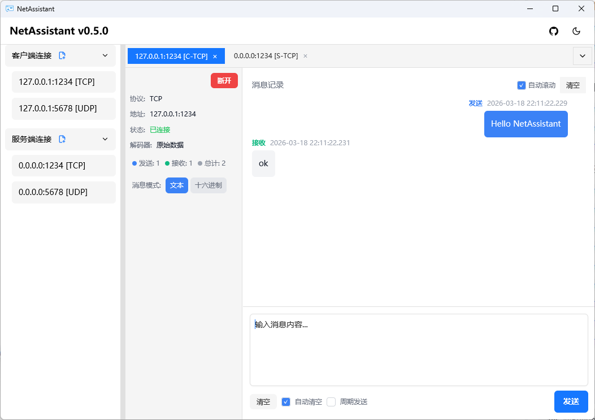
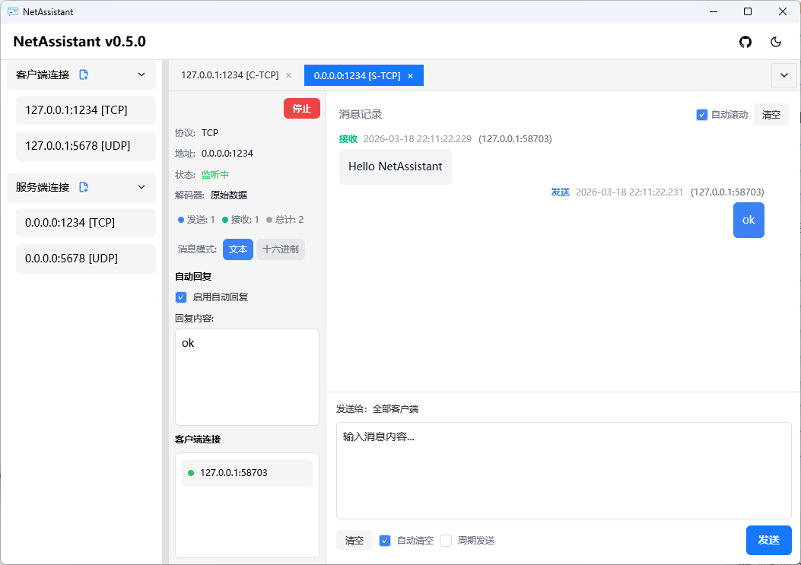

# NetAssistant

<div align="center">

**一个基于 Rust 构建的高性能、现代化的网络调试工具**

[](https://www.rust-lang.org)
[](https://opensource.org/licenses/MIT)

[English](README-en.md) | 中文

</div>

---

## 简介

NetAssistant 是一个基于 Rust 构建的高性能、现代化的网络调试工具。它提供了直观的界面，用于测试和调试网络通信，支持 TCP/UDP 协议的客户端和服务端模式。

## ✨ 功能特性

- **多协议支持**：TCP/UDP 客户端和服务端模式
- **聊天式报文记录**：直观展示报文交互
- **配置持久化**：自动保存连接配置
- **自动回复功能**：支持测试用的自动回复
- **周期发送功能**：支持定时周期性发送消息
- **多标签页管理**：同时管理多个连接
- **客户端消息查看**：选择特定客户端查看其消息

## 🎯 使用场景

- ✅ **物联网设备对接测试**：与各类IoT设备进行通信测试，验证设备响应和数据格式
- ✅ **网络应用开发调试**：开发网络应用时快速测试通信逻辑，验证数据传输格式
- ✅ **嵌入式设备通信验证**：验证嵌入式系统的网络通信协议实现是否正确

## 📸 界面预览

### 客户端模式


### 服务端模式


## 🚀 快速开始

### 前置要求

- Rust 1.70 或更高版本
- Windows 10/11 或 Linux

### 安装

#### 推荐方法：使用 winget 安装
**优势**：支持自动升级，安装和管理更便捷
1. 首先安装 winget（Windows 10 1809+ 或 Windows 11 内置，或参考 [Microsoft 官方文档](https://learn.microsoft.com/zh-cn/windows/package-manager/winget/) 了解安装方法）
2. 打开命令提示符或 PowerShell，运行以下命令：
   ```bash
   winget install SunJary.NetAssistant
   ```
3. 后续升级只需运行：
   ```bash
   winget upgrade SunJary.NetAssistant
   ```

#### 备选方法：从 GitHub Release 下载
请访问 [GitHub Release 页面](https://github.com/sunjary/netassistant/releases) 下载最新版本的安装包。

### 运行

下载完成后，解压安装包并运行可执行文件即可。

## 💡 使用方法

1. **创建连接**
   - 点击左侧面板的 `[+新建]` 按钮
   - 选择连接类型（客户端/服务端）
   - 选择协议（TCP/UDP）
   - 填写地址和端口

2. **连接到服务器**
   - 对于客户端连接，点击 `[连接]` 按钮
   - 对于服务端连接，点击 `[启动]` 按钮

3. **发送消息**
   - 在底部输入框输入消息内容
   - 点击 `[发送]` 按钮或按 Enter 键发送

4. **周期发送**
   - 在连接标签页中启用周期发送功能
   - 设置发送间隔（毫秒）
   - 点击 `[发送]` 按钮开始周期发送
   - 取消勾选周期发送可停止发送任务

5. **自动回复**
   - 在连接标签页中启用自动回复功能
   - 设置自动回复内容
   - 收到消息时自动回复

6. **管理连接**
   - 使用标签页切换不同连接
   - 点击标签页上的 `×` 关闭连接
   - 右键点击连接可以删除保存的配置

7. **客户端消息查看**
   - 在服务端模式下，左侧面板会显示连接的客户端列表
   - 点击单个客户端地址可以选中该客户端，右侧消息列表会只显示该客户端的消息
   - 再次点击已选中的客户端可以取消选择，恢复显示所有消息
   - 服务端回复给该客户端的消息也会包含在查看结果中

## 🎯 技术亮点

### ⚡ 极速性能

- **Rust 驱动**：使用 Rust 构建，实现最大性能和安全性
  - 零成本抽象，编译时优化
  - 内存安全保证，无需垃圾回收
  - 现代化的并发模型

- **Tokio 异步运行时**：高效的异步 I/O 操作
  - 基于 epoll/kqueue 的高性能事件循环
  - 非阻塞 I/O，最大化系统资源利用率
  - 轻量级任务调度，支持百万级并发连接

### 🎨 现代化界面

- **GPUI 框架**：前沿的 GPU 加速 UI
  - 基于 GPU 的渲染，充分利用硬件加速
  - 硬件加速的文本渲染
  - 流畅的 60fps 体验

- **流畅动画**：60fps 渲染的流畅用户体验
  - 平滑的过渡动画
  - 响应式的交互反馈
  - 高帧率的消息滚动

- **响应式设计**：适应不同屏幕尺寸的自适应布局
  - 灵活的窗口大小调整
  - 自适应的消息显示
  - 优化的空间利用

### 🔧 核心功能

- **实时消息监控**：即时消息显示和自动滚动
  - 毫秒级消息响应
  - 自动滚动到最新消息
  - 消息时间戳精确到毫秒

- **连接管理**：支持多个同时连接
  - 多标签页界面
  - 独立的连接状态管理
  - 便捷的连接切换

## 🛠️ 技术栈

### 核心框架
- [GPUI](https://github.com/zed-industries/zed) - GPU 加速 UI 框架
  - 高性能的 GPU 渲染
  - 现代化的组件模型
  - 响应式状态管理

- [gpui-component](https://github.com/longbridge/gpui-component) - 现代 UI 组件库
  - 丰富的 UI 组件
  - 统一的设计语言
  - 易于定制和扩展

### 网络和异步
- [Tokio](https://tokio.rs/) - 网络异步运行时
  - 高性能异步 I/O
  - 丰富的网络协议支持
  - 成熟的生产级解决方案

### 数据处理
- [Serde](https://serde.rs/) - 数据持久化序列化框架
  - 高效的序列化/反序列化
  - 支持多种数据格式
  - 零成本抽象

- [UUID](https://docs.rs/uuid/) - 唯一标识符生成
  - 标准的 UUID v4 实现
  - 用于连接和消息标识

## 📊 性能指标

- **启动时间**：< 100ms
  - 快速启动，无需等待
  - 即时响应用户操作

- **消息吞吐量**：10,000+ 消息/秒
  - 高并发消息处理
  - 低延迟的消息传输

- **内存占用**：< 50MB（空闲状态）
  - 轻量级资源占用
  - 高效的内存管理

- **UI 响应**：60fps 渲染
  - 流畅的用户体验
  - 无卡顿的交互

## 🏗️ 项目结构

```
netassistant/
├── src/                    # 源代码目录
│   ├── main.rs           # 应用入口：初始化日志、创建应用实例、启动主窗口
│   ├── app.rs            # 主应用逻辑：管理连接、处理网络事件、状态管理
│   ├── config/           # 配置管理：连接配置定义、存储和加载
│   │   ├── connection.rs # 连接配置和类型定义
│   │   ├── mod.rs        # 配置模块导出
│   │   └── storage.rs    # 配置持久化存储
│   ├── message.rs        # 消息处理：定义消息结构、处理消息方向和类型
│   ├── ui/               # UI 组件：构建用户界面和处理用户交互
│   │   ├── main_window.rs      # 主窗口组件
│   │   ├── connection_panel.rs # 连接面板：显示和管理连接
│   │   ├── connection_tab.rs   # 连接标签页：每个标签页对应一个连接
│   │   ├── tab_container.rs    # 标签页容器：管理多个标签页
│   │   ├── mod.rs              # UI 模块导出
│   │   └── dialog/             # 对话框组件
│   │       ├── mod.rs          # 对话框模块导出
│   │       └── new_connection.rs # 新建连接对话框
│   └── utils/            # 工具函数：通用工具和辅助功能
│       ├── hex.rs        # 十六进制数据处理
│       └── mod.rs        # 工具模块导出
├── assets/               # 资源文件：图标和截图
│   ├── icon/             # 图标文件
│   └── screenshots/      # 应用截图
├── .cargo/               # Cargo 配置：Rust 构建工具配置
│   └── config.toml       # Cargo 配置文件
├── .github/              # GitHub 配置：CI/CD 工作流
│   └── workflows/        # 工作流配置
│       └── release.yml   # 发布工作流
├── Cargo.toml            # 项目配置：依赖管理和项目元数据
├── Cargo.lock            # 依赖锁文件：固定依赖版本
├── README.md             # 项目文档：中文说明
├── README-en.md          # 英文文档：英文说明
├── build.rs              # 构建脚本：自定义构建逻辑
└── .gitignore            # Git 忽略文件：指定 Git 忽略的文件和目录
```

## 🔮 未来计划

- [ ] 支持 WebSocket 协议
- [ ] 添加消息过滤和搜索功能
- [ ] 增加清空历史消息功能


## 🤝 贡献

欢迎贡献代码、报告问题或提出建议！

1. Fork 本仓库
2. 创建特性分支 (`git checkout -b feature/AmazingFeature`)
3. 提交更改 (`git commit -m 'Add some AmazingFeature'`)
4. 推送到分支 (`git push origin feature/AmazingFeature`)
5. 开启 Pull Request

## 📝 许可证

本项目采用 MIT 许可证 - 详见 [LICENSE](LICENSE) 文件。

## 📮 联系方式

- 项目主页：[https://github.com/sunjary/netassistant](https://github.com/sunjary/netassistant)
- 问题反馈：[https://github.com/sunjary/netassistant/issues](https://github.com/sunjary/netassistant/issues)

## 🙏 致谢

感谢以下开源项目的贡献：

- [GPUI](https://github.com/zed-industries/zed)
- [gpui-component](https://github.com/longbridge/gpui-component)
- [Tokio](https://tokio.rs/)
- [Rust](https://www.rust-lang.org/)

---

<div align="center">

**如果这个项目对你有帮助，请给它一个 ⭐️**

Made with ❤️ by Rust Community

</div>
