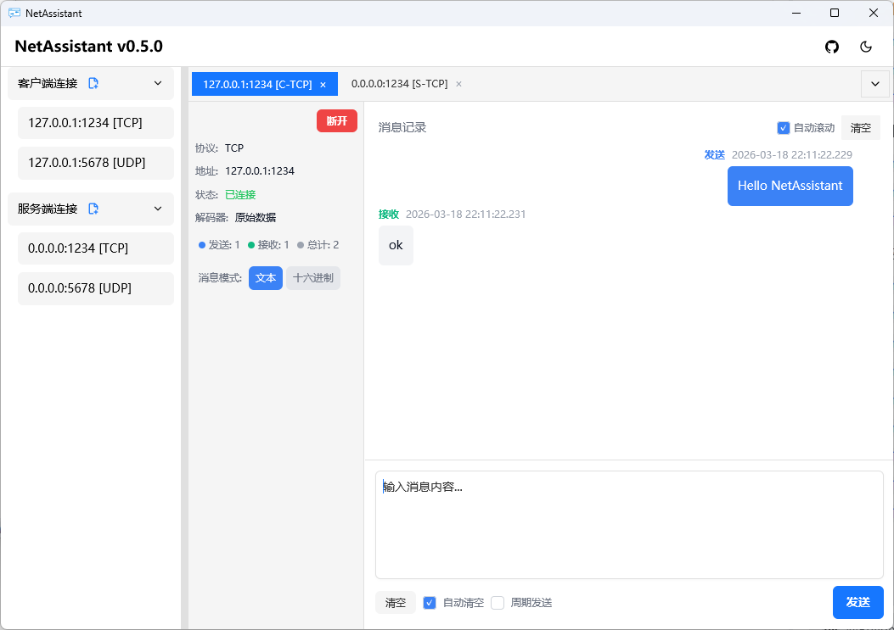
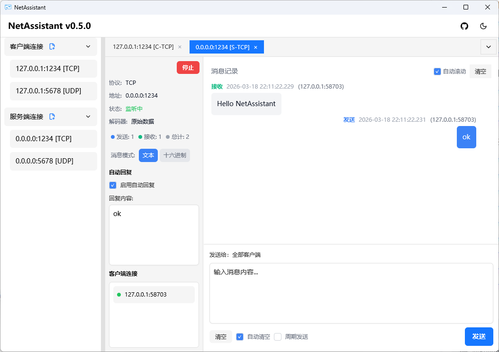
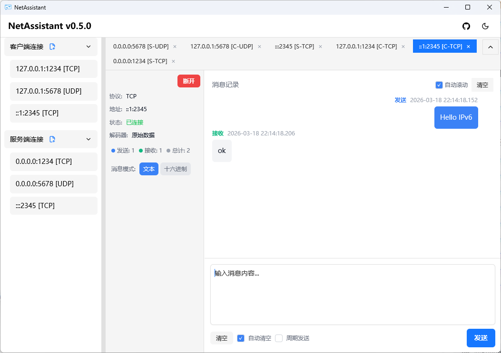
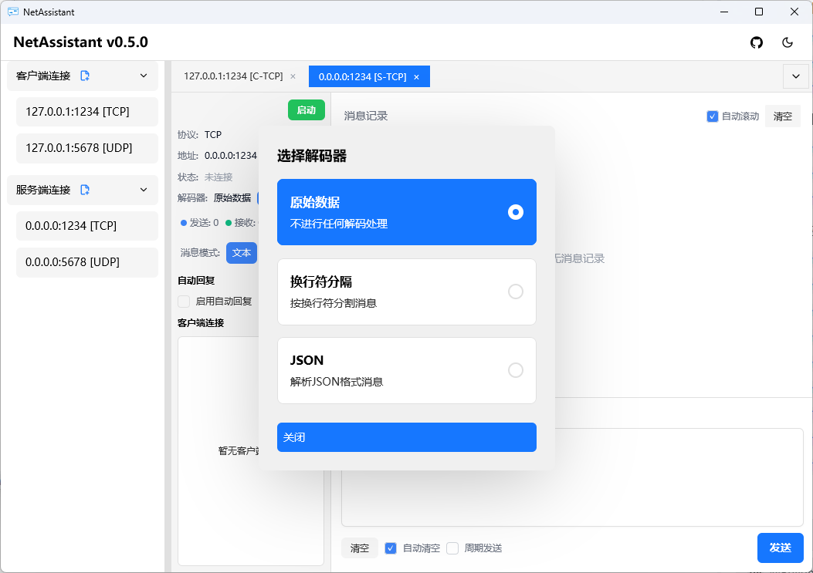
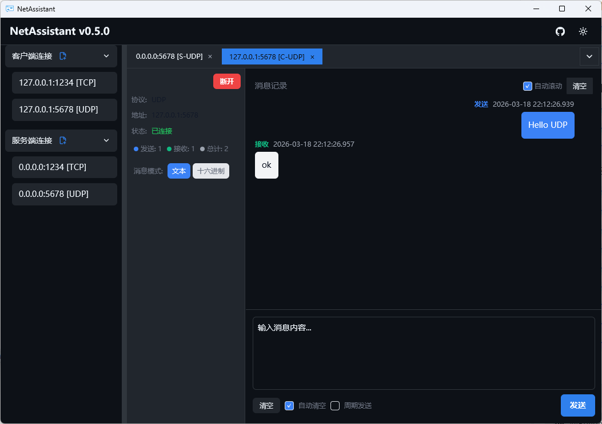
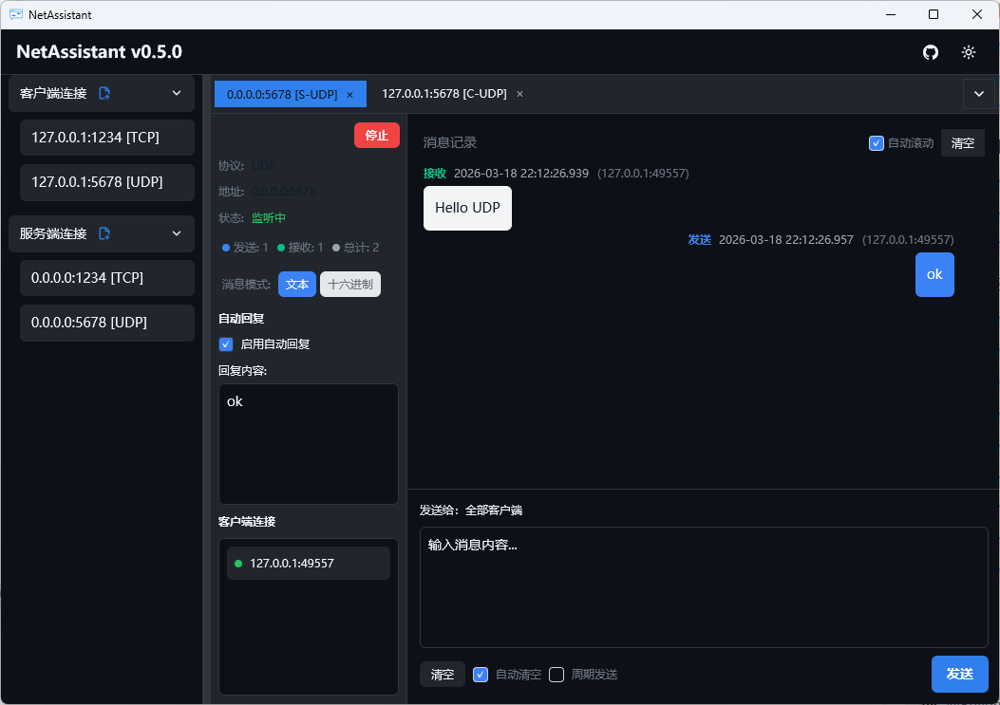
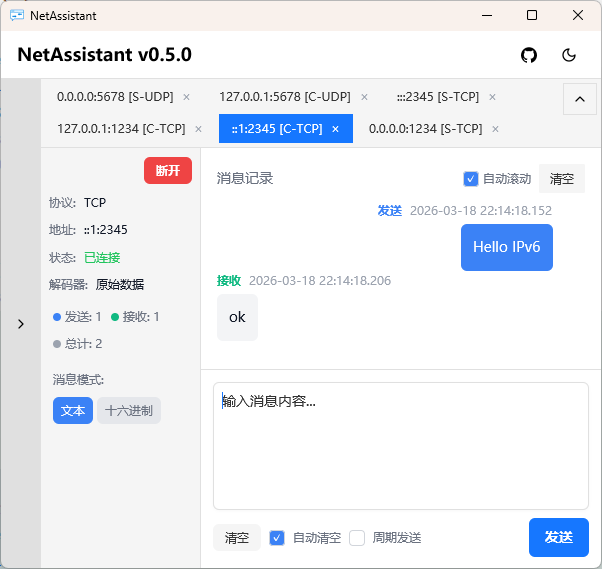

# NetAssistant

<div align="center">

**一个基于 Rust 构建的高性能、现代化的网络调试工具**

[](https://www.rust-lang.org)
[](https://opensource.org/licenses/MIT)

[English](README-en.md) | 中文

</div>

---

## 简介

NetAssistant 是一个基于 Rust 构建的高性能、现代化的**跨平台**网络调试工具，专为开发者设计，**支持 Windows、Linux 和 macOS 系统**。它提供了直观的界面，用于测试和调试网络通信，支持 TCP/UDP 协议的客户端和服务端模式，帮助开发者快速验证网络通信逻辑和数据格式，是网络应用开发、硬件调试和嵌入式系统开发的得力助手。

## ✨ 功能特性

### 核心功能
- **多协议支持**：完整支持 TCP/UDP 客户端和服务端模式
- **IPv4/IPv6 双栈**：同时支持 IPv4 和 IPv6 协议，适应各种网络环境
- **多种 TCP 解码器**：支持原始数据、基于行的解码、长度前缀解码和 JSON 解码，满足不同协议格式需求，有效解决 TCP 粘包问题
- **聊天式报文记录**：直观展示报文交互过程，便于调试和分析
- **配置持久化**：自动保存连接配置，下次启动直接使用

### 自动化测试功能
- **自动回复功能**：支持测试用的自动回复，模拟服务端或客户端响应
- **周期发送功能**：支持定时周期性发送消息，用于压力测试或长时间稳定性测试

### 现代化界面
- **暗黑模式支持**：自动适应系统主题，提供舒适的夜间使用体验
- **多标签页管理**：同时管理多个连接，方便切换和对比
- **客户端消息查看**：在服务端模式下，可选择特定客户端查看其消息

## 🎯 使用场景

- **开发者通信验证**：包括后端开发者对接硬件前模拟硬件发送数据，以及网络应用开发时测试客户端与服务端之间的通信逻辑和数据格式，验证服务端或应用的正确性和鲁棒性
- **硬件设备测试**：涵盖硬件工程师测试常规硬件设备（如传感器、控制器等），以及嵌入式开发者验证资源受限嵌入式系统的网络协议栈实现、数据传输效率和内存占用情况，确保设备网络功能正常运行

## 📸 界面预览

### 客户端模式


### 服务端模式


### IPv6 支持


### TCP 解码器


### UDP 客户端暗黑模式


### UDP 服务端暗黑模式


### 折叠模式


## 🚀 快速开始

### 系统要求

- **Windows**: 10 或更高版本
- **Linux**: 需要 GTK3 库（如 Ubuntu 22.04 及以上版本）
- **macOS**: 10.15 或更高版本

### 安装

#### Windows
**推荐方法：使用 winget 安装**
- 优势：支持自动升级，安装和管理更便捷
- 步骤：
  1. 首先安装 winget（Windows 10 1809+ 或 Windows 11 内置，或参考 [Microsoft 官方文档](https://learn.microsoft.com/zh-cn/windows/package-manager/winget/) 了解安装方法）
  2. 打开命令提示符或 PowerShell，运行以下命令：
     ```bash
     winget install SunJary.NetAssistant
     ```
  3. 后续升级只需运行：
     ```bash
     winget upgrade SunJary.NetAssistant
     ```

**备选方法：从 GitHub Release 下载**
请访问 [GitHub Release 页面](https://github.com/sunjary/netassistant/releases) 下载最新版本。

#### Linux
**推荐方法：从 GitHub Release 下载**
- 步骤：
  1. 请访问 [GitHub Release 页面](https://github.com/sunjary/netassistant/releases) 下载最新版本的 Linux 压缩包
  2. 解压安装包：
     ```bash
     tar -xzf netassistant-linux-x64.tar.gz
     ```
  3. 运行可执行文件：
     ```bash
     ./netassistant
     ```

#### macOS
**推荐方法：从 GitHub Release 下载**
- 步骤：
  1. 请访问 [GitHub Release 页面](https://github.com/sunjary/netassistant/releases) 下载最新版本的 macOS 压缩包
  2. 解压安装包
  3. 将 NetAssistant 拖放到 Applications 文件夹
  4. 右键点击应用程序，选择 "打开" 运行（首次运行需要此操作）

### 运行

根据不同操作系统的安装方法，运行对应的可执行文件即可。

## 💡 使用方法

1. **创建连接**
   - 点击左侧面板的 `[+新建]` 按钮
   - 选择连接类型（客户端/服务端）
   - 选择协议（TCP/UDP）
   - 填写地址和端口
   - 创建完成后，在连接详情页面可以配置 TCP 解码器类型

2. **连接到服务器**
   - 对于客户端连接，点击 `[连接]` 按钮
   - 对于服务端连接，点击 `[启动]` 按钮

3. **选择消息模式**
   - 在底部输入框上方，选择消息发送模式：文本模式或十六进制模式
   - 文本模式：直接输入字符串消息
   - 十六进制模式：输入十六进制格式数据，如 "0A0B0C"

4. **发送消息**
   - 在底部输入框输入消息内容
   - 点击 `[发送]` 按钮或按 Enter 键发送

5. **周期发送**
   - 在连接标签页中启用周期发送功能
   - 设置发送间隔（毫秒）
   - 点击 `[发送]` 按钮开始周期发送
   - 取消勾选周期发送可停止发送任务

6. **自动回复**
   - 在连接标签页中启用自动回复功能
   - 设置自动回复内容
   - 收到消息时自动回复

7. **管理连接**
   - 使用标签页切换不同连接
   - 点击标签页上的 `×` 关闭连接
   - 右键点击连接可以删除保存的配置

8. **客户端消息查看**
   - 在服务端模式下，左侧面板会显示连接的客户端列表
   - 点击单个客户端地址可以选中该客户端，右侧消息列表会只显示该客户端的消息
   - 再次点击已选中的客户端可以取消选择，恢复显示所有消息
   - 服务端回复给该客户端的消息也会包含在查看结果中

## 🎯 技术亮点

### ⚡ 极速性能

- **Rust 驱动**：使用 Rust 构建，实现最大性能和安全性
  - 零成本抽象，编译时优化
  - 内存安全保证，无需垃圾回收
  - 现代化的并发模型

- **Tokio 异步运行时**：高效的异步 I/O 操作
  - 基于 epoll/kqueue 的高性能事件循环
  - 非阻塞 I/O，最大化系统资源利用率
  - 轻量级任务调度，支持百万级并发连接

### 🎨 现代化界面

- **GPUI 框架**：前沿的 GPU 加速 UI
  - 基于 GPU 的渲染，充分利用硬件加速
  - 硬件加速的文本渲染
  - 流畅的 60fps 体验

- **自适应主题**：自动适应系统主题，支持亮色和暗色模式
  - 提供舒适的视觉体验
  - 减少长时间使用的视觉疲劳

- **响应式设计**：适应不同屏幕尺寸的自适应布局
  - 灵活的窗口大小调整
  - 自适应的消息显示
  - 优化的空间利用

### 🔧 核心功能

- **实时消息监控**：即时消息显示和自动滚动
  - 毫秒级消息响应
  - 自动滚动到最新消息
  - 消息时间戳精确到毫秒

- **智能解码器**：多种解码方式，适应不同协议格式
  - 支持原始数据、行分隔、长度前缀和 JSON 格式
  - 可根据协议需求灵活切换

- **连接管理**：支持多个同时连接
  - 多标签页界面
  - 独立的连接状态管理
  - 便捷的连接切换

## 🛠️ 技术栈

### 核心框架
- [GPUI](https://github.com/zed-industries/zed) - GPU 加速 UI 框架
  - 高性能的 GPU 渲染
  - 现代化的组件模型
  - 响应式状态管理

- [gpui-component](https://github.com/longbridge/gpui-component) - 现代 UI 组件库
  - 丰富的 UI 组件
  - 统一的设计语言
  - 易于定制和扩展

### 网络和异步
- [Tokio](https://tokio.rs/) - 网络异步运行时
  - 高性能异步 I/O
  - 丰富的网络协议支持
  - 成熟的生产级解决方案

## 📊 性能指标

- **启动时间**：< 100ms
  - 快速启动，无需等待
  - 即时响应用户操作

- **消息吞吐量**
  - 高并发消息处理
  - 低延迟的消息传输

- **内存占用**：< 20MB
  - 轻量级资源占用
  - 高效的内存管理

- **UI 响应**：60fps 渲染
  - 流畅的用户体验
  - 无卡顿的交互

## 🏗️ 项目结构

```
netassistant/
├── src/                    # 源代码目录
│   ├── main.rs           # 应用入口：初始化日志、创建应用实例、启动主窗口
│   ├── app.rs            # 主应用逻辑：管理连接、处理网络事件、状态管理
│   ├── config/           # 配置管理：连接配置定义、存储和加载
│   │   ├── connection.rs # 连接配置和类型定义
│   │   ├── mod.rs        # 配置模块导出
│   │   └── storage.rs    # 配置持久化存储
│   ├── message.rs        # 消息处理：定义消息结构、处理消息方向和类型
│   ├── network/          # 网络通信：实现TCP/UDP协议、编解码等
│   │   ├── protocol/     # 协议实现：TCP/UDP协议处理
│   │   └── connection/   # 连接管理：客户端和服务端连接
│   ├── ui/               # UI 组件：构建用户界面和处理用户交互
│   │   ├── main_window.rs      # 主窗口组件
│   │   ├── connection_panel.rs # 连接面板：显示和管理连接
│   │   └── connection_tab.rs   # 连接标签页：每个标签页对应一个连接
│   └── utils/            # 工具函数：通用工具和辅助功能
│       ├── hex.rs        # 十六进制数据处理
│       └── mod.rs        # 工具模块导出
├── assets/               # 资源文件：图标和截图
│   ├── icon/             # 图标文件
│   └── screenshots/      # 应用截图
├── .cargo/               # Cargo 配置：Rust 构建工具配置
├── .github/              # GitHub 配置：CI/CD 工作流
├── Cargo.toml            # 项目配置：依赖管理和项目元数据
├── Cargo.lock            # 依赖锁文件：固定依赖版本
├── README.md             # 项目文档：中文说明
├── README-en.md          # 英文文档：英文说明
└── build.rs              # 构建脚本：自定义构建逻辑
```

## 🔮 未来计划

- [ ] 支持sse调试
- [ ] 支持更多数据格式的编解码
- [ ] 压力测试

## 📦 从源代码编译（可选）

如果您需要自定义编译或获取最新开发版本，可以从源代码编译：

```bash
git clone https://github.com/sunjary/netassistant.git
cd netassistant
cargo build --release
```

编译完成后，可执行文件将位于 `target/release` 目录下。

## 🤝 贡献

欢迎贡献代码、报告问题或提出建议！

1. Fork 本仓库
2. 创建特性分支 (`git checkout -b feature/AmazingFeature`)
3. 提交更改 (`git commit -m 'Add some AmazingFeature'`)
4. 推送到分支 (`git push origin feature/AmazingFeature`)
5. 开启 Pull Request

## 📝 许可证

本项目采用 Apache License 2.0 许可证 - 详见 [LICENSE](LICENSE) 文件。

## 📮 联系方式

- 项目主页：[https://github.com/sunjary/netassistant](https://github.com/sunjary/netassistant)
- 问题反馈：[https://github.com/sunjary/netassistant/issues](https://github.com/sunjary/netassistant/issues)

## 🙏 致谢

感谢以下开源项目的贡献：

- [GPUI](https://github.com/zed-industries/zed)
- [gpui-component](https://github.com/longbridge/gpui-component)
- [Tokio](https://tokio.rs/)
- [Rust](https://www.rust-lang.org/)

---

<div align="center">

**如果这个项目对你有帮助，请给它一个 ⭐️**

Made with ❤️ by Rust Community

</div>