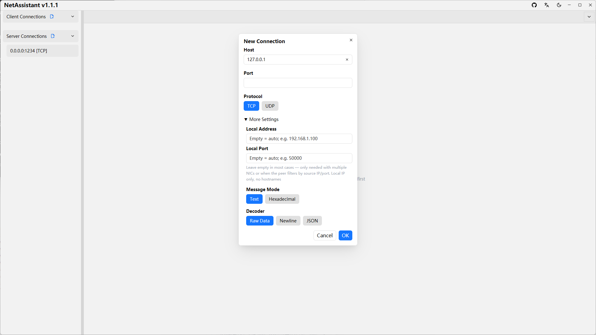

# Getting Started

## System Requirements

- **Windows**: 10 or later, on x64 or ARM64
- **Linux**: GTK3 library required (e.g. Ubuntu 22.04 or later), on x86_64 or ARM64
- **macOS**: 10.15 or later

## Installation

### Windows

**Recommended: install with winget**

```bash
winget install SunJary.NetAssistant
```

To upgrade later, simply run:

```bash
winget upgrade SunJary.NetAssistant
```

**Alternative**: download the latest version from the [GitHub Release](https://github.com/sunjary/netassistant/releases) page. On ARM64 devices (Surface Pro X, Snapdragon laptops, etc.) neither winget nor the installer is available — download `netassistant-windows-aarch64.zip` instead.

### Linux

1. Download the latest deb package from the [GitHub Release](https://github.com/sunjary/netassistant/releases) page (recommended for Debian/Ubuntu and derivatives, Ubuntu 22.04 and later)
2. Install (dependencies resolved automatically):

```bash
sudo apt install ./netassistant-linux-x86_64.deb
```

3. Launch from the application menu, or run `netassistant` in a terminal

On other distros, use the AppImage (portable, first run needs `sudo apt install libfuse2`) or extract the tar.gz and run the binary directly.

On ARM64 devices (Raspberry Pi 5, ARM servers, etc.) replace `x86_64` with `aarch64` in the filename above.

### macOS

1. Download the latest macOS archive from the [GitHub Release](https://github.com/sunjary/netassistant/releases) page
2. Extract the archive and drag NetAssistant into the Applications folder
3. Right-click the app and choose "Open" to run it (required on first launch)

See the [Download page](/en/download) for more details.

## Your First Debug Session: Three Steps

1. **Create a connection**: click the `[+ New]` button in the left panel, choose the connection type (client/server) and protocol (TCP/UDP), then fill in the address and port. After creation, you can configure the TCP decoder type on the connection detail page.
2. **Start the connection**: for a client connection, click `[Connect]`; for a server connection, click `[Start]`.
3. **Send a message**: choose the send mode (text or hex) above the input box at the bottom, type your content, then click `[Send]` or press Enter.



Next steps:

- Running into sticky packet issues while debugging TCP? → Read [TCP/UDP Debugging](/en/guide/tcp-udp)
- Need to simulate peer responses, send periodically, or run stress tests? → Read [Stress Testing](/en/guide/stress)
