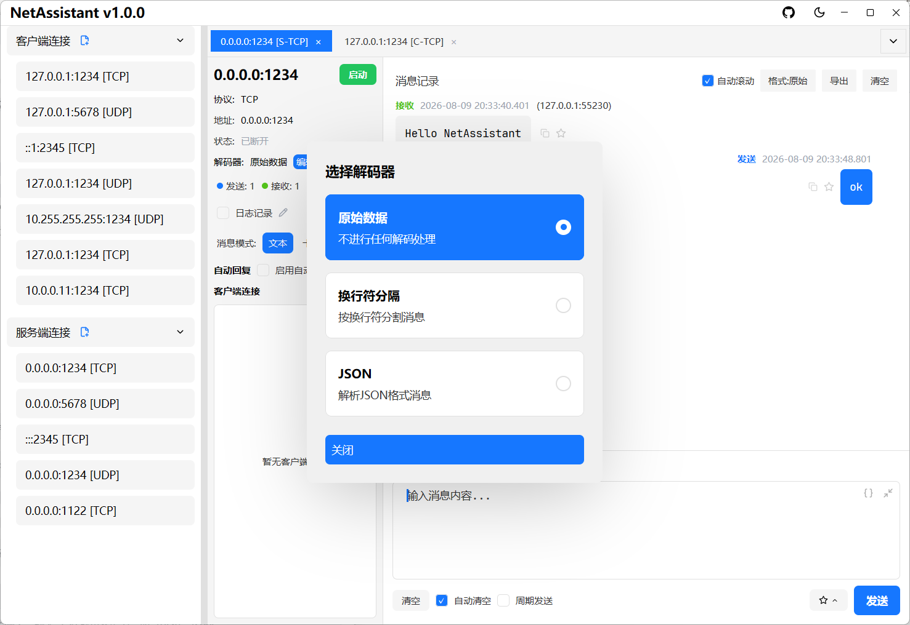
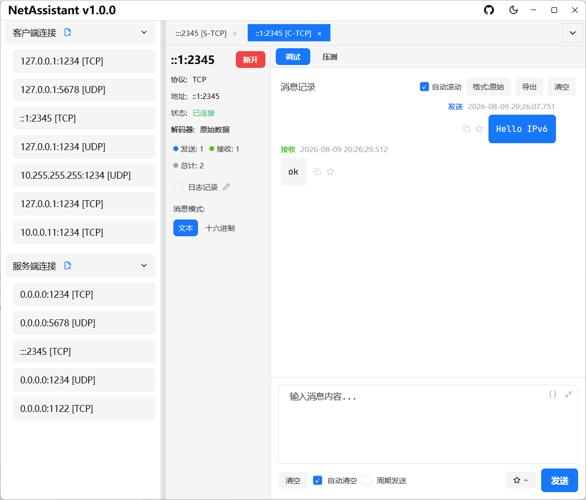
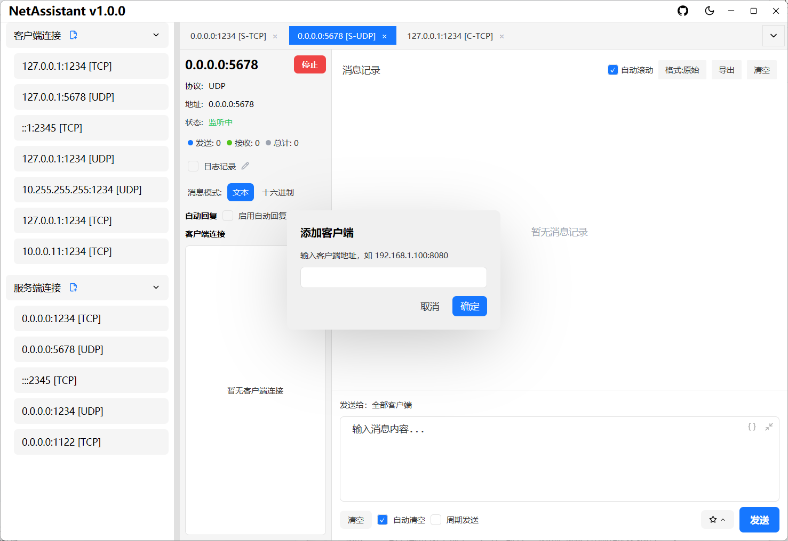
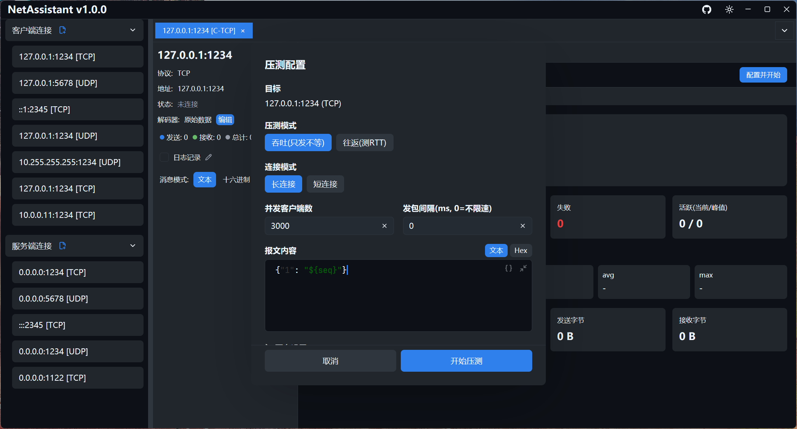
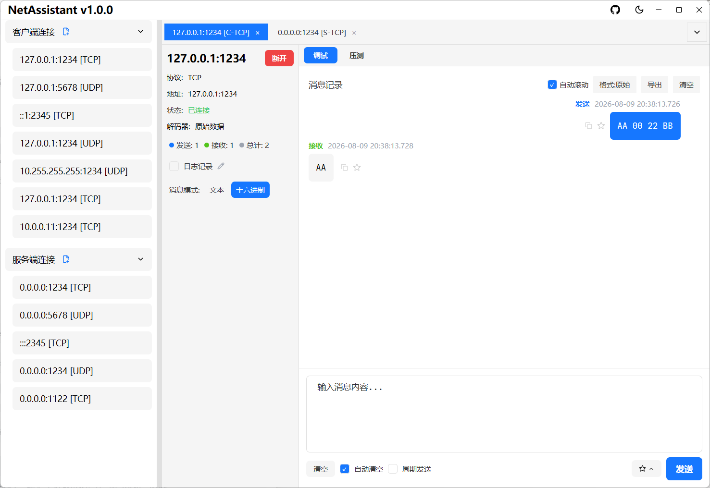

# TCP/UDP Debugging

## TCP Decoders

TCP is a byte-stream protocol and suffers from sticky/split packet issues. NetAssistant offers four decoders on the connection detail page — pick one based on your protocol format:

| Decoder | Use Case |
| ------- | -------- |
| Raw | No processing; bytes are displayed exactly as received |
| Line-delimited | Newline as the message boundary, suitable for text protocols (e.g. AT commands, log streams) |
| Length-prefix | Splits packets by a length field, suitable for binary protocols |
| JSON | Automatically detects JSON messages, suitable for JSON over TCP |

## Message Modes

Choose the send mode above the input box at the bottom:

- **Text mode**: type plain string messages; when entering JSON, use the "Prettify" and "Minify" buttons to format the outgoing payload
- **Hex mode**: enter data in hexadecimal format, e.g. `0A0B0C`, suitable for binary protocol debugging

The receive area can switch between Raw/Prettified/Minified display formats globally: prettified shows indented JSON, minified removes whitespace, and non-JSON content is displayed as-is.

## Periodic Send

1. Enable periodic send on the connection tab
2. Set the send interval (in milliseconds)
3. Click `[Send]` to start periodic sending
4. Uncheck periodic send to stop the sending task

Suitable for long-run stability tests or simulating device heartbeats.

## Auto-Reply

1. Enable auto-reply on the connection tab
2. Set the auto-reply content
3. Incoming messages are answered automatically

Suitable for simulating server or client responses and verifying the peer's handling logic.

## Message Management

- **Copy message**: click the copy button on a message item to copy its content to the clipboard (text and hex formats supported)
- **Favorite messages**: click the favorite button to add a message to favorites, add a remark in the popup, and locate it quickly via keyword search
- **Export message history**: click the export button and choose TXT / JSON / CSV to save locally
- **Real-time logging**: toggle "Log Recording" on and all messages are written asynchronously to a log file in real time (each message is flushed to disk automatically). By default logs are saved to `Documents/NetAssistant/logs/`; click the pencil button to customize the path, click the log file name to open its directory, and the log is flushed and closed automatically on disconnect

## IPv6 Support

Addresses support both IPv4 and IPv6 when creating a connection — enter `::1` or `fe80::xxxx` to debug in an IPv6 environment.

## UDP Scenarios

### Manual Client Addition

UDP is connectionless, so a server cannot inherently detect its clients. In UDP server mode:

1. Click the `[+ Add Client]` button
2. Enter the target client's IP and port
3. Once added, you can proactively send messages to that address

### Device Discovery (Host Workstation / IoT Debugging)

When you need to discover IoT/embedded devices on the local network:

1. Send a discovery command to the broadcast address (e.g. `192.168.1.255`)
2. Replies from all devices are displayed normally (never filtered by source address)
3. Device replies from non-target addresses are marked with a **light-red highlight** on the source address, with an "Unexpected address reply" tooltip on hover
4. No important device response is lost, while broadcast replies stay clearly distinguished from normal replies to the target address

## Multiple Connections & Client View

- **Multi-tab management**: switch between connections using tabs; click the `×` on a tab to close the connection; right-click a connection to delete or edit its saved config
- **Per-client message view**: in server mode, the left panel shows the list of connected clients; click a client address to view only that client's messages, and click again to deselect and show all messages

## Hex Mode & HEX Editor

