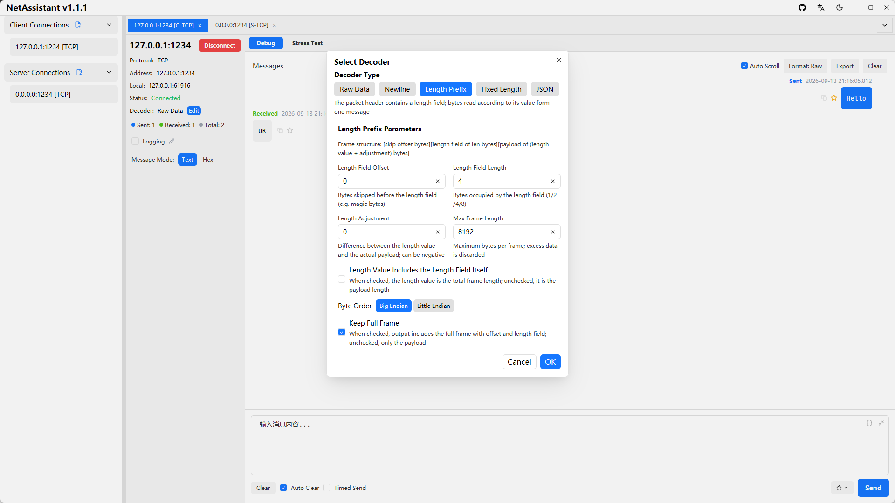
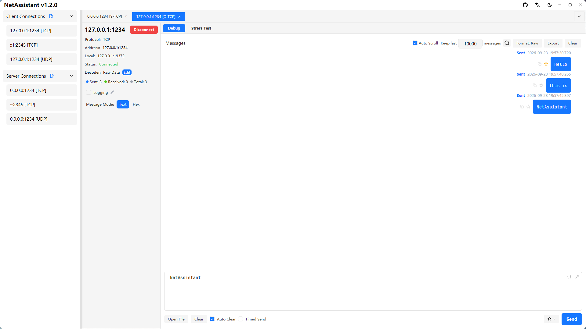
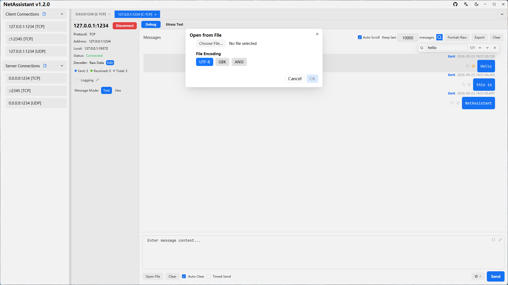
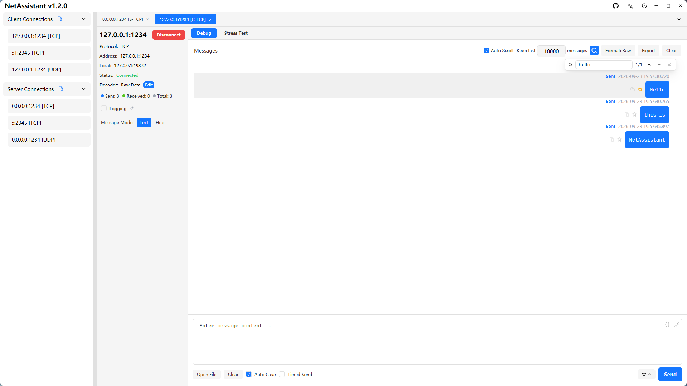
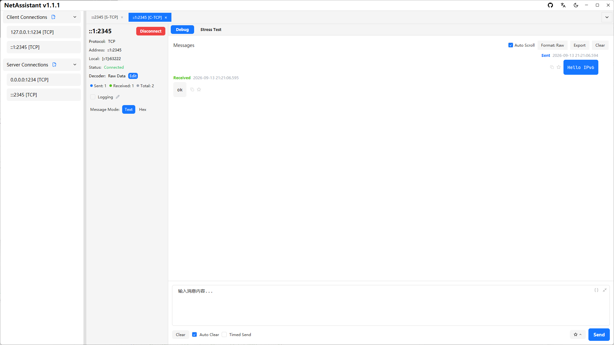
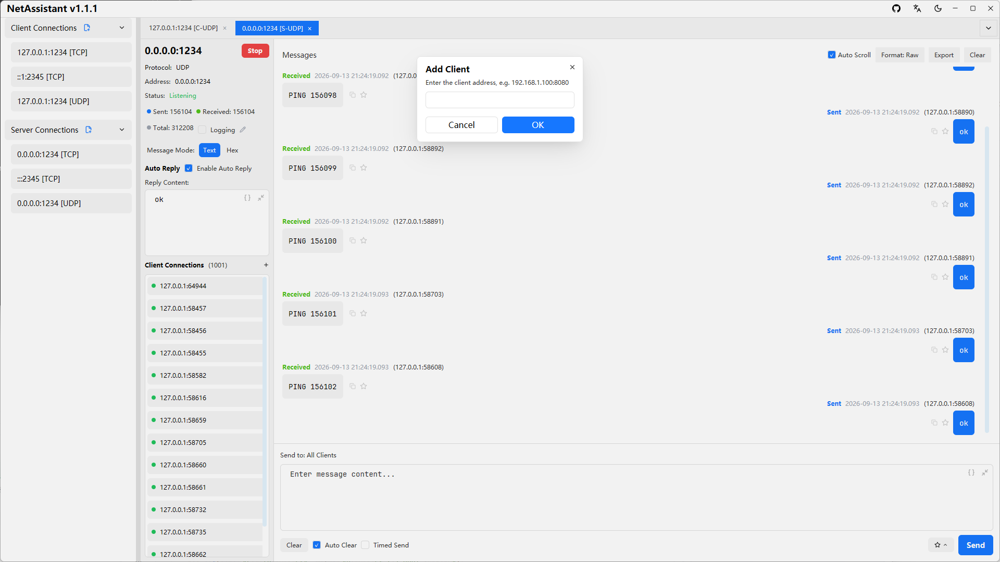
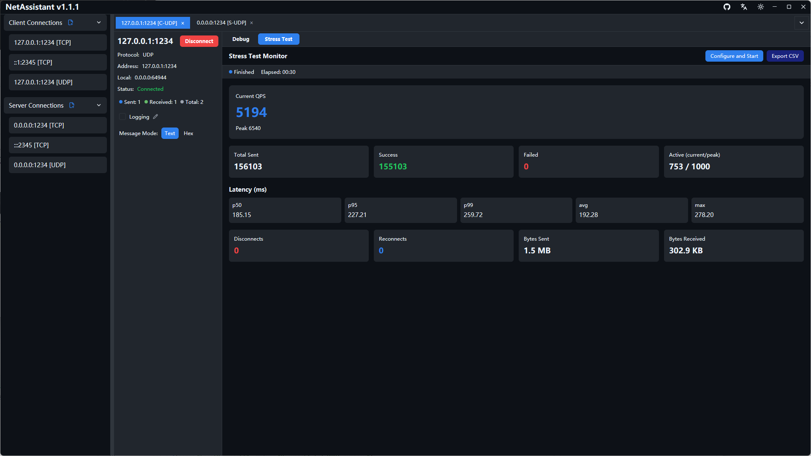
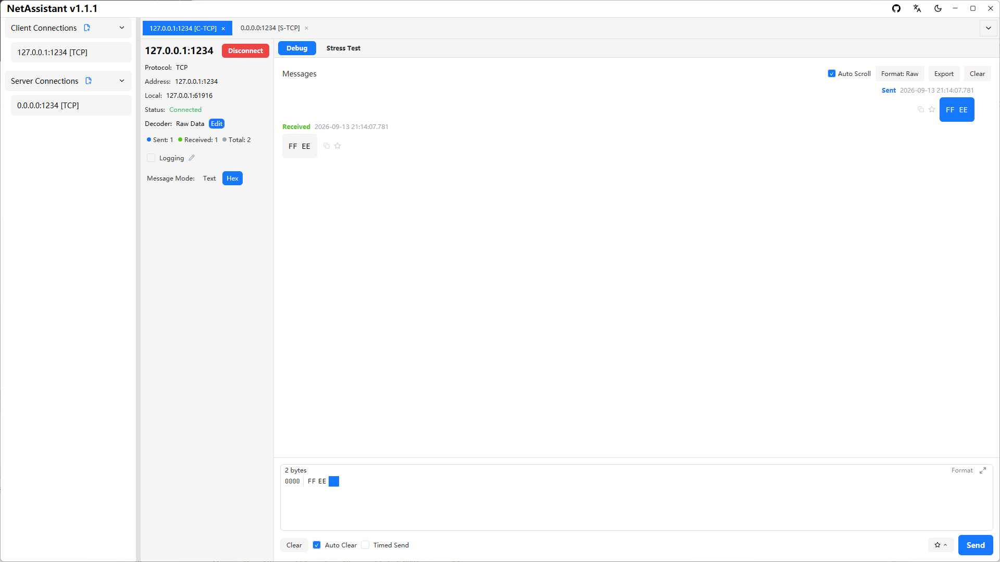

# TCP/UDP Debugging

## TCP Decoders

TCP is a byte-stream protocol and suffers from sticky/split packet issues. NetAssistant offers four decoders on the connection detail page — pick one based on your protocol format:

| Decoder | Use Case |
| ------- | -------- |
| Raw | No processing; bytes are displayed exactly as received |
| Line-delimited | Newline as the message boundary, suitable for text protocols (e.g. AT commands, log streams) |
| Length-prefix | Splits packets by a length field, suitable for binary protocols |
| JSON | Automatically detects JSON messages, suitable for JSON over TCP |

## Message Modes

Choose the send mode above the input box at the bottom:

- **Text mode**: type plain string messages; when entering JSON, use the "Prettify" and "Minify" buttons to format the outgoing payload
- **Hex mode**: enter data in hexadecimal format, e.g. `0A0B0C`, suitable for binary protocol debugging

The receive area can switch between Raw/Prettified/Minified display formats globally: prettified shows indented JSON, minified removes whitespace, and non-JSON content is displayed as-is.

### ASCII ↔ Hex Conversion

Switching between text mode and hex mode converts the input content as UTF-8, so there is no need to rewrite it by hand:

- **Text → Hex**: every character is encoded as two uppercase hex digits per UTF-8 byte, e.g. `ok` → `6F 6B`
- **Hex → Text**: bytes are decoded back to characters; non-printable bytes are escaped as `\n` `\r` `\t` `\\` and `\xNN`, e.g. `00 FF` → `\x00 \xFF`

As a result, `Hex → Text → Hex` round-trips byte-for-byte, so binary data is never lost in conversion; `${...}` variable placeholders are preserved as-is.

You can also **right-click** inside the input and pick "Convert to Hex / Convert to Text": the selected text (or the whole content when nothing is selected) is converted and the result is shown in a read-only window you can copy from — the input itself is **not** rewritten.

### Importing Content from a File

Click the "Open File" button in the toolbar to read a local file into the send box:

1. Choose a file (1 MiB limit; the size is shown in a 1024-based human-readable form such as `256 KB`)
2. Choose the file encoding: UTF-8 (strict decoding — invalid bytes prompt you to pick another encoding), GBK, or ANSI (system code page)
3. Preview the result and click "OK" to fill the send box

In hex mode the file is imported as **raw bytes** with no encoding involved; content over 4096 bytes falls back to text editing while the payload stays complete.

## Periodic Send

1. Enable periodic send on the connection tab
2. Set the send interval (in milliseconds)
3. Click `[Send]` to start periodic sending
4. Uncheck periodic send to stop the sending task

Suitable for long-run stability tests or simulating device heartbeats.

## Auto-Reply

1. Enable auto-reply on the connection tab
2. Set the auto-reply content
3. Incoming messages are answered automatically

Suitable for simulating server or client responses and verifying the peer's handling logic.

## Message Management

- **Copy message**: click the copy button on a message item to copy its content to the clipboard (text and hex formats supported)
- **Favorite messages**: click the favorite button to add a message to favorites, add a remark in the popup, and locate it quickly via keyword search
- **Export message history**: click the export button and choose TXT / JSON / CSV to save locally
- **Real-time logging**: toggle "Log Recording" on and all messages are written asynchronously to a log file in real time (each message is flushed to disk automatically). By default logs are saved to `Documents/NetAssistant/logs/`; click the pencil button to customize the path, click the log file name to open its directory, and the log is flushed and closed automatically on disconnect

### Message Search

Press `Ctrl+F` or click the magnifier icon in the toolbar to open the search overlay (non-modal, floating in the top-right corner of the message area):

1. Type a keyword to see the match counter `i/n` live (`0/0` when nothing matches)
2. `Enter` or `↓` jumps to the next match; `Shift+Enter` or `↑` jumps to the previous one, wrapping around at the ends
3. The matching row is highlighted with a light grey background and scrolled into view
4. `Esc` or `✕` closes the overlay

Search matches the **raw content** of messages (independent of the Raw/Prettified/Minified display format) and only covers messages currently held in memory (after the per-client filter is applied). Jumping turns auto-scroll off so that eviction cannot make the position drift.

### Message Count Cap

The "Keep last" input next to auto-scroll in the toolbar defaults to `10000`:

- Once the cap is exceeded, the oldest messages are dropped so memory does not grow during long stress runs. Press Enter or click elsewhere (blur) to apply the value
- `0` means unlimited (memory then keeps growing with the message volume)
- Turning auto-scroll off sets the value to `0` and disables it: nothing is dropped and the list is fully frozen, which makes reading back through history comfortable
- Turning auto-scroll back on restores the previous value, trims the list to it immediately and scrolls to the bottom
- Note: with dropping disabled (`0` or auto-scroll off) messages keep accumulating, so memory grows noticeably under heavy or long-running traffic. To reclaim it, click "Clear" in the toolbar, or re-enable auto-scroll with a smaller cap — the excess is dropped immediately and memory usage goes down

## IPv6 Support

Addresses support both IPv4 and IPv6 when creating a connection — enter `::1` or `fe80::xxxx` to debug in an IPv6 environment.

## Local Port Binding

By default, client connections let the OS pick the local interface and an ephemeral port. When the peer whitelists by source address/port (industrial devices, firewall rules, etc.), specify them under New/Edit Connection → "More Settings":

- **Local Address**: the local IP to use (e.g. `192.168.1.100`); leave empty for auto selection. IP only — hostnames are not accepted
- **Local Port**: the local port to use (e.g. `50000`); leave empty for automatic assignment

Once connected, the "Local" row in the left info panel shows the effective local endpoint (including auto-assigned UDP ports). The local address family must match the remote: IPv4 remote ↔ IPv4 local, same for IPv6.

Note: with a fixed local port, rapid TCP reconnects may fail briefly with a clear error while the port sits in TIME_WAIT; a local port occupied by another process also fails with an explicit error message.

## UDP Scenarios

### Manual Client Addition

UDP is connectionless, so a server cannot inherently detect its clients. In UDP server mode:

1. Click the `[+ Add Client]` button
2. Enter the target client's IP and port
3. Once added, you can proactively send messages to that address

### Device Discovery (Host Workstation / IoT Debugging)

When you need to discover IoT/embedded devices on the local network:

1. Send a discovery command to the broadcast address (e.g. `192.168.1.255`)
2. Replies from all devices are displayed normally (never filtered by source address)
3. Device replies from non-target addresses are marked with a **light-red highlight** on the source address, with an "Unexpected address reply" tooltip on hover
4. No important device response is lost, while broadcast replies stay clearly distinguished from normal replies to the target address

## Multiple Connections & Client View

- **Multi-tab management**: switch between connections using tabs; click the `×` on a tab to close the connection; right-click a connection to delete or edit its saved config
- **Per-client message view**: in server mode, the left panel shows the list of connected clients; click a client address to view only that client's messages, and click again to deselect and show all messages

## Hex Mode & HEX Editor

## Keyboard Shortcuts

| Shortcut | Action |
| -------- | ------ |
| `Ctrl+Enter` | Send the current tab's message |
| `Ctrl+F` | Open the message search overlay (re-focuses it if already open; does not close it) |
| `Ctrl+Tab` / `Ctrl+Shift+Tab` | Cycle to the next / previous tab |
| `Ctrl+PageDown` / `Ctrl+PageUp` | Switch to the next / previous tab |
| `Ctrl+1` … `Ctrl+9` | Jump directly to the Nth tab |
| `Ctrl+W` | Close the current tab |
| `Ctrl+N` | New connection |
| `Ctrl+K` | Focus the message input |
| `Esc` | Close the search overlay or the favorites list |

Use `Cmd` instead of `Ctrl` on macOS. The shortcuts work regardless of the current focus: they are available whether the focus is in an input, the HEX editor or empty space. One exception: inside a code editor (message input, auto-reply, stress payload), `Ctrl+F` opens the editor's own find panel instead of the message search overlay.
