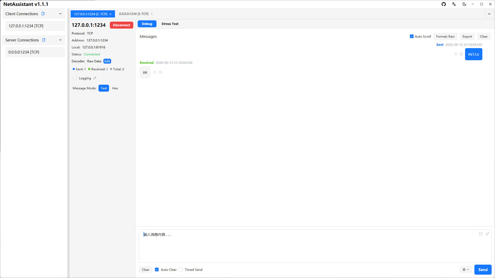
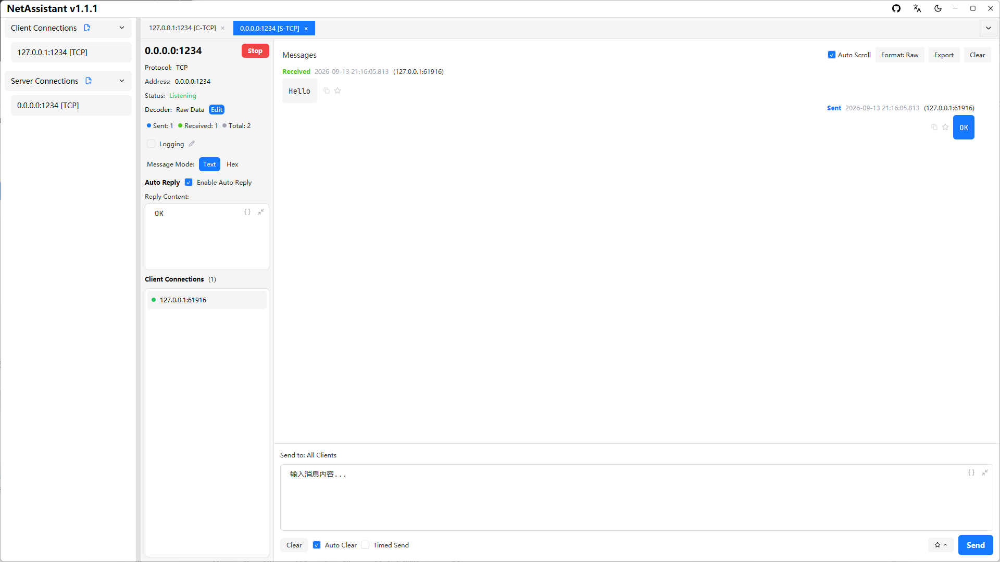
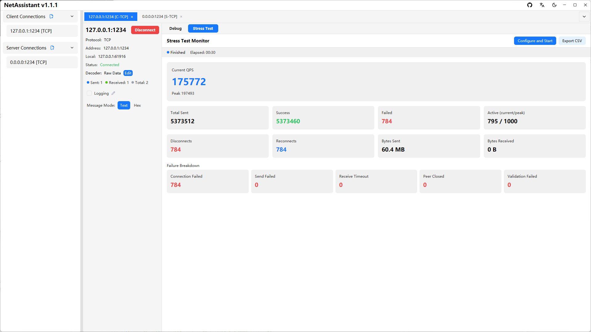
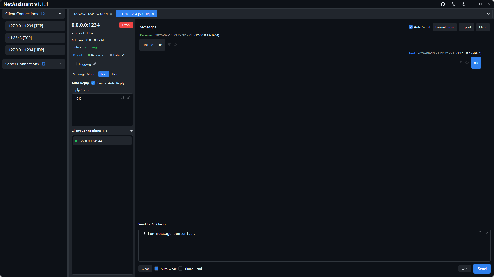

## Screenshots

### Client Mode

### Server Mode

### Stress Testing

### Dark Mode

## Why NetAssistant

- **Blazing performance**: Rust + Tokio async runtime, startup < 100ms, memory footprint < 20MB, million-level concurrent connections
- **Built for debugging**: from network app development to hardware and embedded debugging, covering the entire communication verification workflow
- **Cross-platform**: full support for Windows, Linux and macOS, with native builds for both x64 and ARM64
- **Open source and free**: released under the Apache-2.0 License, contributions welcome

For more details, see [Features](/en/features); to get started, read the [Guide](/en/guide/). To see how it compares with NetAssist and similar tools, check the [Comparison](/en/comparison).
