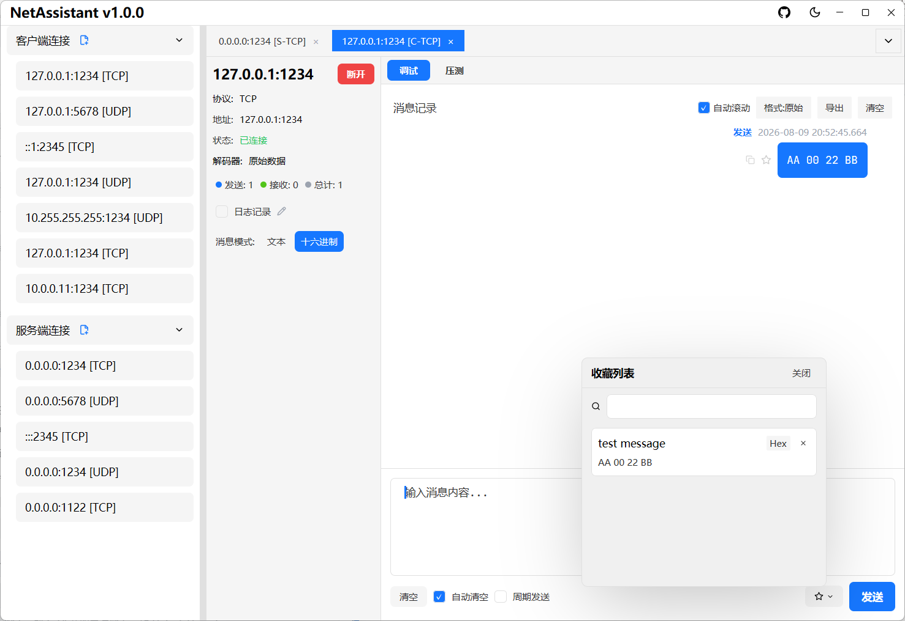

# 功能特性

NetAssistant 是一个基于 Rust 构建的高性能、现代化的**跨平台**网络调试工具，专为开发者设计，支持 Windows、Linux 和 macOS 系统。

## 核心功能

- **多协议支持**：完整支持 TCP/UDP 客户端和服务端模式
- **IPv4/IPv6 双栈**：同时支持 IPv4 和 IPv6 协议，适应各种网络环境
- **多种 TCP 解码器**：支持原始数据、基于行的解码、长度前缀解码和 JSON 解码，满足不同协议格式需求，有效解决 TCP 粘包问题
- **JSON 格式化**：发送框在文本模式提供「美化/压缩」按钮格式化待发送内容；接收区顶部可切换「原始/美化/压缩」全局显示格式，非 JSON 内容原样返回
- **聊天式报文记录**：直观展示报文交互过程，便于调试和分析
- **配置持久化**：自动保存连接配置，下次启动直接使用

## 消息管理功能

- **复制消息**：快速复制单条消息内容到剪贴板，支持文本和十六进制两种格式
- **收藏消息**：将重要消息添加到收藏夹，支持为收藏项添加备注说明，并提供关键字搜索
- **实时日志记录**：手动开启后所有收发消息实时异步写入日志文件（每条 flush 落盘），支持自定义保存路径，断开连接自动刷新关闭
- **随时手动导出**：可随时导出当前消息记录为 TXT/JSON/CSV 格式文件，便于归档、分享和二次分析
- **UDP 广播回复智能展示**：针对上位机/物联网设备发现场景优化，向广播地址发送指令后接收所有设备回复，非预期地址的回复用红色高亮标识，不丢失重要响应
- **连接配置编辑**：已保存的连接配置支持直接编辑修改，无需删除重建

## 自动化测试功能

- **自动回复功能**：支持测试用的自动回复，模拟服务端或客户端响应
- **周期发送功能**：支持定时周期性发送消息，用于压力测试或长时间稳定性测试
- **压力测试功能**：内置 TCP/UDP 高并发压力测试引擎，详见[压力测试指南](/guide/stress)

## 现代化界面

- **暗黑模式支持**：自动适应系统主题，提供舒适的夜间使用体验
- **多标签页管理**：同时管理多个连接，方便切换和对比
- **客户端消息查看**：在服务端模式下，可选择特定客户端查看其消息
- **UDP 手动添加客户端**：在 UDP 服务端模式下，可手动添加客户端地址，便于主动向指定地址发送数据

## 技术亮点

### ⚡ 极速性能

- **Rust 驱动**：零成本抽象、内存安全、无垃圾回收
- **Tokio 异步运行时**：基于 epoll/kqueue 的高性能事件循环，支持百万级并发连接

### 🎨 现代化界面

- **GPUI 框架**：GPU 加速渲染与文本渲染，流畅 60fps 体验
- **自适应主题**：自动适应系统亮色/暗色模式
- **响应式设计**：适应不同屏幕尺寸的自适应布局

### 🔧 架构设计

- **压测引擎独立成层**：零 GPUI 依赖的纯逻辑设计，便于复用与测试；基于令牌桶的速率限制，精准控制发送频率
- **核心逻辑与 UI 解耦**：消息处理器独立于界面层，网络协议层与界面层清晰分离

## 性能指标

开发过程中使用内置压测功能对 NetAssistant 自身进行了高并发测试，借此发现并优化了多个性能瓶颈（消息批量更新、批量日志写入等）：

| 指标 | 表现 |
| ---- | ---- |
| 启动时间 | < 100ms |
| 内存占用 | < 20MB |
| UI 响应 | 60fps 渲染 |

## 使用场景

- **开发者通信验证**：后端开发者对接硬件前模拟硬件发送数据；测试客户端与服务端之间的通信逻辑和数据格式，验证服务端的正确性和鲁棒性
- **硬件设备测试**：硬件工程师测试传感器、控制器等设备；嵌入式开发者验证资源受限系统的网络协议栈实现与传输效率
- **服务性能压测**：对自研服务端进行并发吞吐、延迟分布和稳定性评估，快速定位性能瓶颈
