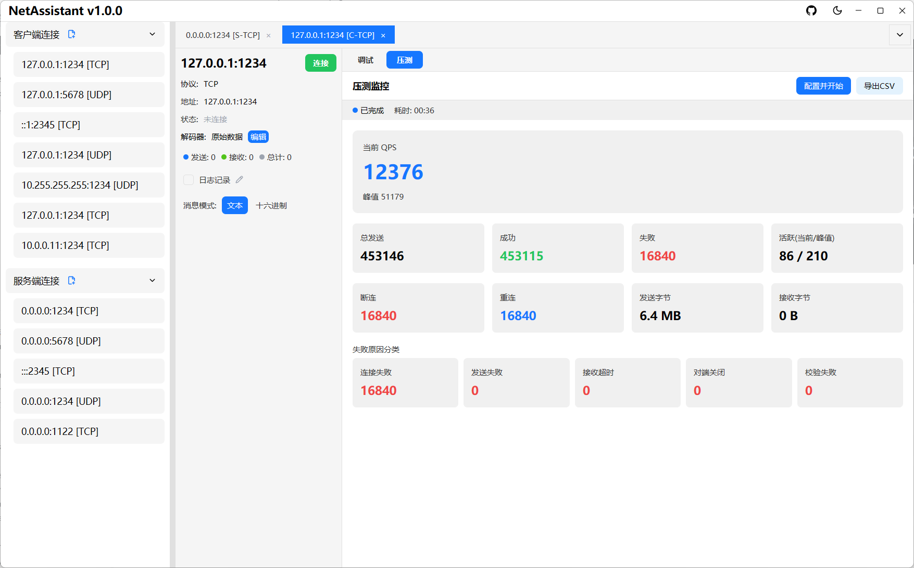

# 压力测试

NetAssistant 内置 TCP/UDP 高并发压力测试引擎，用于对服务端进行并发吞吐、延迟分布和稳定性评估。压测引擎为零 GPUI 依赖的独立逻辑层，基于令牌桶精确控制发送速率。

## 配置压测

1. 通过标签页上的「压测」入口切换到压力测试页面
2. 填写目标地址、端口、并发客户端数、发送速率、消息内容
3. 消息内容支持变量模板（见下文）
4. 选择压测模式与连接模式
5. 点击开始；压测配置自动保存，下次打开自动回填

## 压测模式

| 模式 | 说明 | 适用场景 |
| ---- | ---- | -------- |
| Ping-Pong（往返） | 发送后等待响应，统计 RTT 延迟（p50/p95/p99/平均/最大） | 接口性能测试 |
| 吞吐模式 | 只发送不等待响应，不统计延迟 | 最大吞吐量测试 |

连接模式支持**短连接**（每次请求新建连接）与**长连接**。

## 变量模板

消息内容支持以下变量模板，每次发送时动态替换：

| 模板 | 含义 |
| ---- | ---- |
| `${seq}` | 全局序号 |
| `${worker_id}` | 线程 ID |
| `${counter}` | 本地计数 |
| `${timestamp}` | 时间戳 |
| `${uuid}` | 随机 UUID |
| `${random:min:max}` | 随机整数 |

## 实时指标

压测运行中，压力测试面板实时展示：

- **QPS**：当前值与峰值
- **发送统计**：总发送 / 成功 / 失败
- **连接统计**：活跃连接（当前/峰值）、断连/重连
- **流量统计**：收发字节
- **延迟分位数**：p50 / p95 / p99 / 平均 / 最大（仅 Ping-Pong 模式）
- **失败原因分类**：连接失败 / 发送失败 / 接收超时 / 对端关闭 / 校验失败，帮助快速定位瓶颈

## 报告导出

测试结束后可导出 CSV 格式的详细统计报告；测试过程中点击停止按钮可随时终止。
