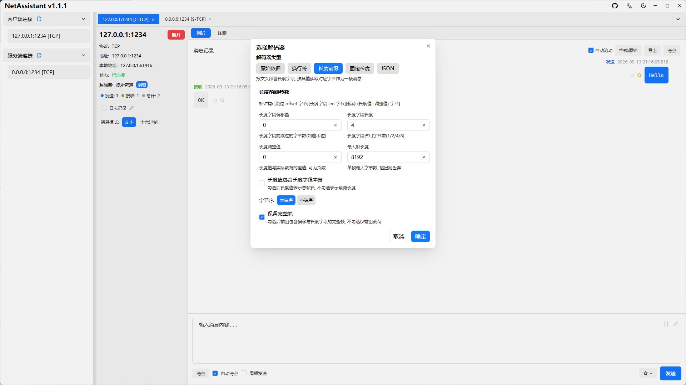
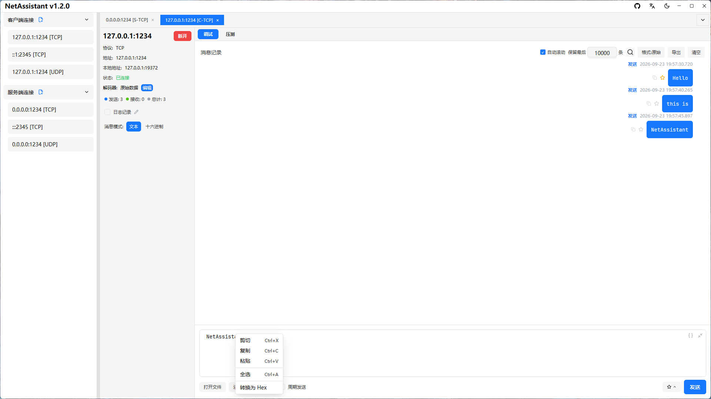
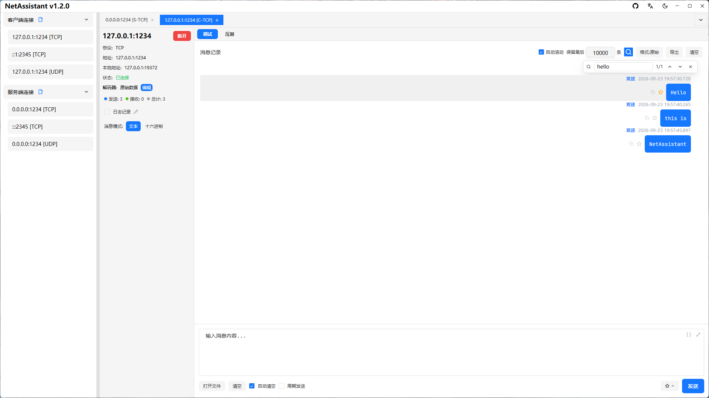
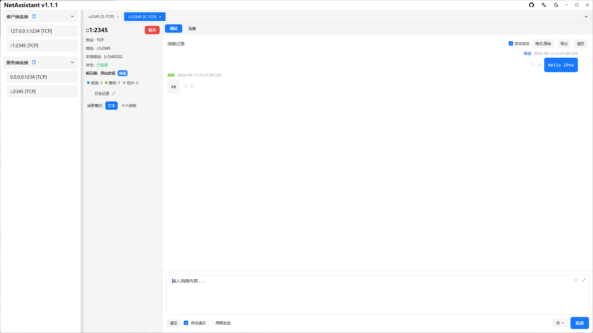
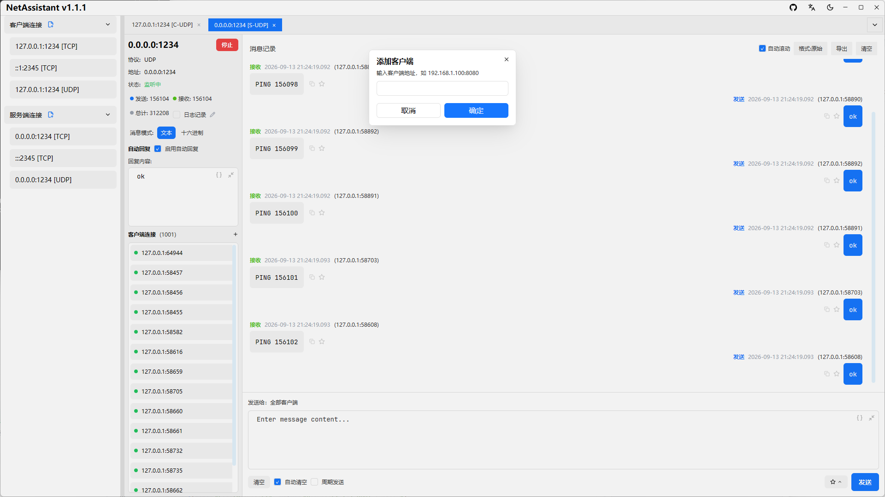
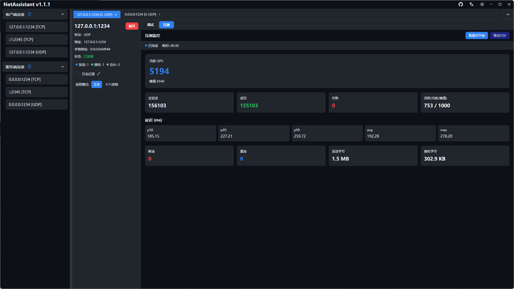
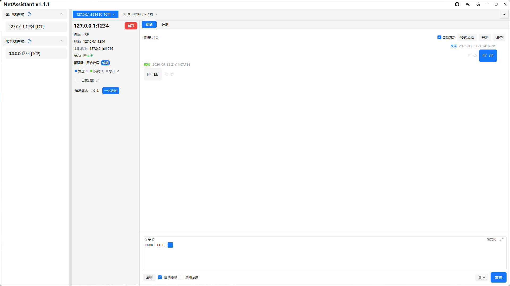

# TCP/UDP 调试

## TCP 解码器

TCP 是字节流协议，存在粘包/拆包问题。NetAssistant 在连接详情页提供四种解码器，按你的协议格式选择：

| 解码器 | 适用场景 |
| ------ | -------- |
| 原始数据 | 不做任何处理，按收到的字节原样展示 |
| 行分隔 | 以换行符为消息边界，适合文本协议（如 AT 指令、日志流） |
| 长度前缀 | 按长度字段分包，适合二进制协议 |
| JSON | 自动识别 JSON 报文，适合 JSON over TCP |

## 消息模式

在底部输入框上方选择消息发送模式：

- **文本模式**：直接输入字符串消息；输入 JSON 时可用「美化」「压缩」按钮格式化待发送内容
- **十六进制模式**：输入十六进制格式数据，如 `0A0B0C`，适合二进制协议调试

接收区顶部可切换「原始/美化/压缩」全局显示格式：美化展示 JSON 缩进，压缩去除空白，非 JSON 内容原样显示。

### ASCII ↔ Hex 互转

在文本模式与十六进制模式之间切换时，输入框内容会按 UTF-8 整体互转，无需手工改写：

- **文本 → Hex**：每个字符按 UTF-8 字节编码为两位十六进制（大写），如 `ok` → `6F 6B`
- **Hex → 文本**：字节解码为字符，不可打印字节以 `\n` `\r` `\t` `\\` 与 `\xNN` 转义表示，如 `00 FF` → `\x00 \xFF`

因此 `Hex → 文本 → Hex` 往返后字节完全一致，二进制数据不会在转换中丢失；`${...}` 变量占位符在转换时原样保留。

也可以在输入框内**右键**选择「转换为 Hex / 转换为文本」：对选中内容（未选中则对全文）执行转换，结果在只读窗口中展示并可一键复制，**不会改写输入框内容**。

### 从文件导入内容

点击工具栏「打开文件」按钮，可从本地文件读取内容并填入发送框：

1. 选择文件（上限 1 MiB，文件大小为 1024 进制可读格式，如 `256 KB`）
2. 选择文件编码：UTF-8（严格解码，非法字节会提示改用其它编码）、GBK、ANSI（系统代码页）
3. 预览确认后点击「确定」填入发送框

十六进制模式下文件按**原始字节**导入，不涉及编码；内容超过 4096 字节时会自动切换为文本编辑，发送内容保持完整。

## 周期发送

1. 在连接标签页中启用周期发送功能
2. 设置发送间隔（毫秒）
3. 点击 `[发送]` 按钮开始周期发送
4. 取消勾选周期发送可停止发送任务

适合长时间稳定性测试或模拟设备心跳。

## 自动回复

1. 在连接标签页中启用自动回复功能
2. 设置自动回复内容
3. 收到消息时自动回复

适合模拟服务端或客户端响应，验证对端处理逻辑。

## 消息管理

- **复制消息**：点击消息项上的复制按钮，将内容复制到剪贴板（支持文本和十六进制格式）
- **收藏消息**：点击收藏按钮将消息加入收藏夹，可在弹窗中填写备注，并通过关键字搜索快速定位
- **导出消息记录**：点击导出按钮，选择 TXT / JSON / CSV 格式保存到本地
- **实时日志记录**：点击「日志记录」开关开启后，所有消息实时异步写入日志文件（每条消息自动 flush 落盘）。默认保存到 `文档/NetAssistant/logs/` 目录，点击铅笔按钮可自定义路径，日志文件名可点击直接打开所在目录，断开连接自动刷新关闭

### 消息搜索

`Ctrl+F` 或点击工具栏的放大镜图标打开搜索浮层（非模态，悬浮在消息区右上角）：

1. 输入关键字即时显示命中计数 `i/n`（无命中显示 `0/0`）
2. `Enter` 或 `↓` 跳到下一个命中，`Shift+Enter` 或 `↑` 跳到上一个；到达末尾后环形回到开头
3. 命中项整行以浅灰底高亮，并自动滚动到视口
4. `Esc` 或 `✕` 关闭浮层

搜索匹配的是报文**原始内容**（与「原始/美化/压缩」显示格式无关），范围为当前保留在内存中的消息（已应用客户端过滤）。跳转时会自动关闭自动滚动，避免消息淘汰导致定位漂移。

### 消息条数上限

工具栏「自动滚动」旁可设置「保留最后 N 条」，默认 `10000`：

- 超出上限后自动淘汰最早的消息，避免长时间压测下内存持续增长；输入后按回车或点击别处（失焦）生效
- `0` 表示不限制（此时内存会随消息量持续增长）
- 关闭「自动滚动」时该值自动置 `0` 并禁用：不淘汰任何消息，列表完全冻结，便于向上翻阅历史
- 重新开启「自动滚动」会恢复原来的设置值，并立即裁剪到该条数、滚动到底部
- 注意：不淘汰时（`0` 或关闭自动滚动）消息会持续累积，大量收发或长时间压测下内存占用会明显增长；需要回收内存时，点击工具栏的「清空」按钮，或重新开启自动滚动并设置较小的条数上限——超出部分会被立即丢弃，内存占用随之下降

## IPv6 支持

创建连接时地址支持 IPv4 与 IPv6 双栈，例如填入 `::1` 或 `fe80::xxxx` 即可调试 IPv6 环境。

## 本地端口绑定

默认情况下，客户端连接由系统自动选择本地网卡与临时端口。当对端按源地址/源端口做白名单（工业设备、防火墙规则等）时，可在新建/编辑连接 → 「更多设置」中指定：

- **本地地址**：客户端使用的本机 IP（如 `192.168.1.100`），留空由系统自动选择网卡；仅支持 IP，不支持域名
- **本地端口**：客户端使用的本地端口（如 `50000`），留空由系统自动分配

连接成功后，左侧信息面板的「本地地址」行会显示实际生效的本地端点（UDP 自动分配的临时端口也在此可见）。本地地址族需与远端一致：IPv4 远端配 IPv4 本地地址，IPv6 同理。

注意：TCP 固定本地端口快速重连时，端口可能因 TIME_WAIT 短暂占用而报错；本地端口被其他进程占用时也会明确报错提示。

## UDP 场景

### 手动添加客户端

UDP 是无连接协议，服务端无法天然感知客户端。在 UDP 服务端模式下：

1. 点击 `[+添加客户端]` 按钮
2. 输入目标客户端的 IP 和端口
3. 添加完成后即可主动向该地址发送消息

### 设备发现（上位机/物联网调试）

当需要发现局域网内的物联网/嵌入式设备时：

1. 向广播地址（如 `192.168.1.255`）发送 discovery 指令
2. 所有设备的回复都会正常显示（不会被源地址过滤）
3. 来自非目标地址的设备回复，源地址会用**浅红色高亮**标识，鼠标悬停显示「非预期地址的回复」提示
4. 既不丢失重要的设备响应，又能清晰区分广播回复与目标地址正常回复

## 多连接与客户端查看

- **多标签页管理**：使用标签页切换不同连接，点击标签页上的 `×` 关闭连接，右键点击连接可删除或编辑保存的配置
- **客户端消息查看**：服务端模式下，左侧面板显示已连接的客户端列表；点击单个客户端地址可只查看该客户端的消息，再次点击取消选择恢复显示所有消息

## 十六进制模式与 HEX 编辑

## 快捷键

| 快捷键 | 功能 |
| ------ | ---- |
| `Ctrl+Enter` | 发送当前标签页的消息 |
| `Ctrl+F` | 打开消息搜索浮层（已打开则重新聚焦，不用于关闭） |
| `Ctrl+Tab` / `Ctrl+Shift+Tab` | 循环切换到下一个 / 上一个标签页 |
| `Ctrl+PageDown` / `Ctrl+PageUp` | 切换到下一个 / 上一个标签页 |
| `Ctrl+1` … `Ctrl+9` | 直接跳转到第 N 个标签页 |
| `Ctrl+W` | 关闭当前标签页 |
| `Ctrl+N` | 新建连接 |
| `Ctrl+K` | 聚焦消息输入框 |
| `Esc` | 关闭搜索浮层或收藏夹列表 |

macOS 上使用 `Cmd` 代替 `Ctrl`。快捷键在任何焦点状态下均生效：焦点位于输入框、HEX 编辑器或空白区域时都可使用。例外：在代码编辑器（消息输入框、自动回复、压测报文）内按 `Ctrl+F` 打开的是编辑器自带的查找面板，不会唤起消息搜索。
